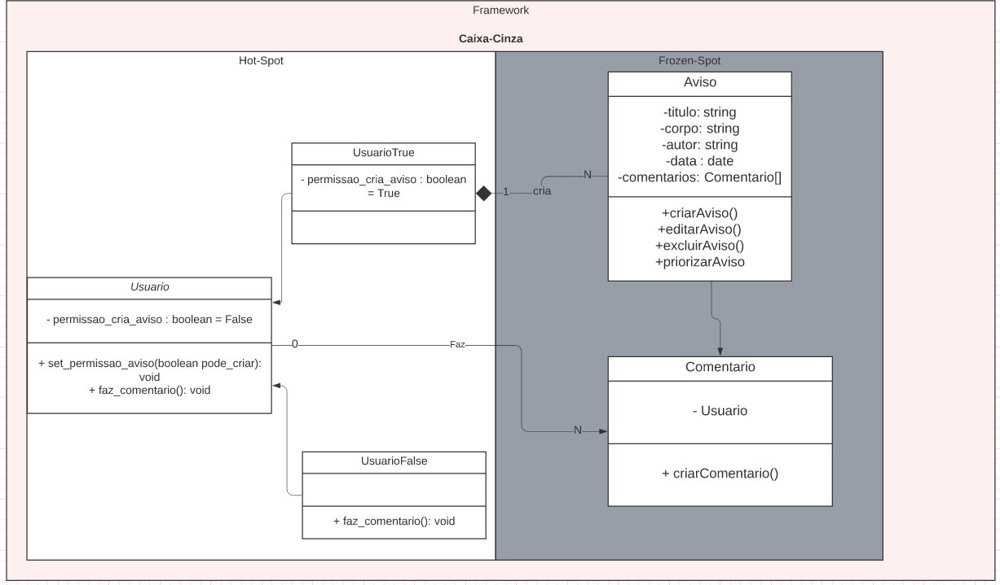

# Reutilização de Software

## Introdução

A reutilização de software é um recurso utilizado para diminuição do retrabalho e aumento da produtividade e redução no esforço ao desenvolver novos produtos. Aproveitando os recursos previamente desenvolvidos e usando-os em novos contextos. 

Sendo assim ela pode ser introduzida em diferentes níveis do desenvolvimento de software, sendo algum deles, design, código, testes e requisitos. Essa reutilização facilita até mesmo a manutenibilidade do projeto, melhorando assim mais qualidade e o ciclo de vida do produto.

## Frontend

### Componets

Os componentes são partes do código reutilizaveis e independentes, onde podem ser tratadas de forma isolada no códigos. Elas recebem entradas que serão adaptadas para cada contexto. Sendo assim, quando todo o código estiver feito a base de componentes a montagem das páginas será feita toda a partir dos componentes, então só será necessário fazer a montagem.

### Services

As services exercem a função de conexão com o Backend, utilizamos o Axios para fazer essa conexão e a comunicação entre Backend e Frontend.

## Backend
Imaginando uma implementação para reutilização do software para o backend, utilizando um framework, é possível imaginar pedaços de hots-spot e frozen-spot para um protótipo inicial do que seria o nosso framework.

### Framework
Um framework é a solução geral de problemas semelhantes, que utiliza classes e interfaces para resolver um problema a partir de uma solução geral. Parte dessas classes devem ser flexíveis e extensível para permitir a construção de várias aplicações com o menor esforço possível [Serrano, 2020].

### Hot-spot
A ideia é que utilizemos hot-spot, que é uma flexibilidade a mais para o desenvolvedor, criar tipos de Usuários que utilizará uma aplicação de avisos.

### Frozen-spot
A ideia é o usuário não ter controle na formação da classe de Aviso, mas com o ganho da automatização do front-end.

### Diagrama

<h4 align = "center">Figura 1: Primeira versão</h6>
<h4 align = "center">Fonte: Autores</h6>

A ideia é demonstrar a parte mais controlada (Frozen-spot) e a parte que o desenvolvedores teria condições de evoluir (hot-spot). Como mostrado, o Frozen-spot possui avisos e comentarios imutáveis, a grande motivação para isto, é que é possível criar automaticamente as páginas de aviso e comentários relacionado a um usuário, o grande problema é que teríamos uma classe Aviso para casos específicos. Já para os hot-spots, podemos observar que os desenvolvedores poderiam criar quantos Usuario fosse necessário, utilizando um atributo de controle, que diz se é possível criar aviso ou não.

Desta forma, é feito o controle dos usuários com permissão, e sem permissão.

## Docker e Docker Compose

## Referências

- Reutilização de Software - Revista Engenharia de Software Magazine 39. - Disponível em <https://www.devmedia.com.br/reutilizacao-de-software-revista-engenharia-de-software-magazine-39/21956>: Acesso em: 07/09/2022.
- SERRANO, Milene; Arquitetura e Desenho de Software, Aula - Reutilização de Software. UnB-FGA. Acesso em: 07/09/2022.
- FastAPI - Disponível em: <https://fastapi.tiangolo.com/pt/>. Acesso em: 07/09/2022.
- O Que é React e Como Funciona? - Disponível em: <https://www.hostinger.com.br/tutoriais/o-que-e-react-javascript>. Acesso em: 07/09/2022.
- Docker Compose: O que é? Para que serve? O que come? - Disponível em: <https://imasters.com.br/banco-de-dados/docker-compose-o-que-e-para-que-serve-o-que-come>. Acesso em: 07/09/2022.
- Docker e Docker Compose um guia para iniciantes. Disponível em: <https://dev.to/ingresse/docker-e-docker-compose-um-guia-para-iniciantes-48k8>. Acesso em: 07/09/2022.

## Versionamento

| Data  | Versão |                     Descrição                      |   Autor(es)  | Revisor |
| :---: | :----: | :------------------------------------------------: | :----------: | :-----: |
| 07/09 |  0.1   |Criação do documento e adição da introdução e referências| Davi Marinho |  XXXX   |
| 08/09 |  0.2   |            Adiciona o conteúdo sobre frontend           | Davi Marinho |  XXXX   |
| 08/09 |  0.3   |            Adicionando Backend          | Deivid Carvalho |  XXXX   |