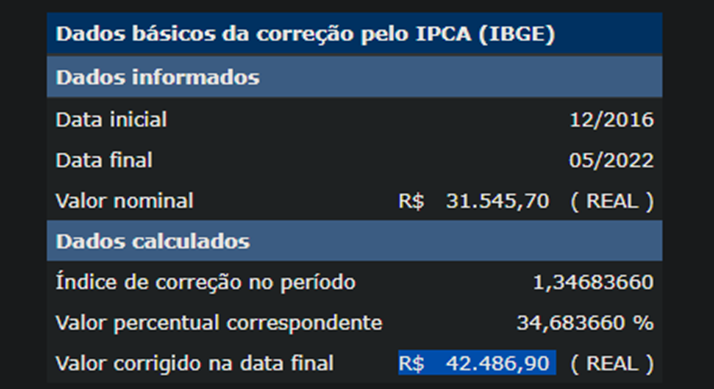

<!-- # 1.1. Módulo Projeto Não Orientado a Abordagens Específicas

Estudar o domínio de aplicações similares, e realizar Design Sprint para levantamento dos principais artefatos e requisitos.

Foco_1: Técnicas de Elicitação, Artefatos Independentes de Metodologia e Esboço da Baseline de Requisitos (Priorizada)

Entrega Mínina: Design Sprint, 5W2H, Mapa Mental, Diagrama Causa-Efeito, Rich Picture, Léxico (ou Glossário) e Planos de Risco, Custo e Tempo.

Apresentação (em sala) explicando passo a passo a Design Sprint realizada, com: (i) rastro claro aos membros participantes; (ii) justificativas & senso crítico sobre o trabalho realizado; (iii) breve apresentação dos artefatos
elaborados, e (iv) comentários gerais sobre iniciativas extras. Tempo da Apresentação: +/- 10min. Recomendação: Apresentar diretamente via Wiki ou GitPages do Projeto.

A Wiki ou GitPages do Projeto deve conter um tópico dedicado ao Módulo Projeto Não Orientado a Abordagens Específicas, com artefatos, histórico de versões, referências, e demais detalhamentos gerados pela equipe nesse escopo.

Demais orientações disponíveis nas Diretrizes (vide Moodle). -->

# 1.1. Módulo Projeto Não Orientado a Abordagens Específicas

Com o objetivo de estudar e orientar a equipe, durante uma reunião no dia 20/06 foi feito pelo Antônio Rangel um levantamento inicial das entregas que deveriamos fazer:

- Criar o GitPages com os subtópicos definidos no template da professora (1 pessoa)

- Fazer a Design Sprint (todos juntos)
	2.1 - Debater aspectos e documentar com mapas mentais
	2.2 - Modelar usando desenho (Ex: Rich Picture)
	2.3 - Escolher o melhor modelo dentre os feitos pelos membros
	2.4 - Fazer protótipo de média ou alta fidelidade

- Documento descrevendo a design sprint (1 pessoa)

- Backlog priorizado (1 pessoa)

- 5W2H (1 pessoa)

- Mapa mental (1 pessoa)

- Diagrama Causa-Efeito (1 pessoa)

- Rich Picture (1 pessoa)

- Léxico (ou Glossário) (1 pessoa)

- Plano de riscos (1 ou 2 pessoas)

- Estimativas de custo e esforços (1 ou 2 pessoas)

- Documento sobre as escolhas metodológicas (1 pessoa)

- Modelagem BPMN (1 ou 2 pessoas)

Logo após, foi determinado em um kanban pelo Deivid Carvalho e Davi Marinho, o que todos deveriam fazer baseado no que foi levantado antes.

## 2. Fazer a Design Sprint
Com auxílio da ferramenta miro, conseguimos alinhar diversas ideias e realizar diversas metodologias para entendermos o que iremos desenvolver. Link para acesso a este documento [miro](https://miro.com/app/board/uXjVOrXcOYI=/?share_link_id=260970383105)

### 2.1 - Debater aspectos e documentar com mapas mentais

Aqui foi feito com toda a equipe, em uma reunião do discord, diversas discussões para o entendimento do que iremos desenvolver. Para isto foi feito um mapa mental em grupo, com toda a equipe para alinharmos o que devemos fazer, ligar ideias e definir algumas funcionalidades do nosso sistema. Visitar o [miro](https://miro.com/app/board/uXjVOrXcOYI=/?share_link_id=260970383105) para mais detalhe de imagem.

### 2.2 - Modelar usando desenho (Ex: Rich Picture)

Para esta etapa, foi utilizado o processo rich picture. A ideia consiste em todos os membros colocar em um fluxo de desenho o que foi entendido por cada membro, com a ideia de expor em mais baixo nível algumas funcionalidades e tipos de usuários. Logo após, fazer uma análise em grupo e decidir um rich picture final que expõe melhor a ideia geral do projeto. O print abaixo demonstra a área do quadro que todos colaboraram, para mais detalhe visite [miro](https://miro.com/app/board/uXjVOrXcOYI=/?share_link_id=260970383105).

### 2.3 - Escolher o melhor modelo dentre os feitos pelos membros

## É, não é, faz, não faz

Essa metodologia auxiliou a equipe para garantirmos que no momento de definirmos as funcionalidades, não houvesse má compreensão do que nosso software deseja entregar. Ela consiste em escrever em cartões o que nosso software é, o que ele não é, o que ele faz e o que ele não irá fazer jamais. A seguir um print do esboço feito pela equipe, para ver com detalhes [miro](https://miro.com/app/board/uXjVOrXcOYI=/?share_link_id=260970383105).

## 5W2H

O intuito é expor os objetivos do software, descrevendo o que é, a motivação de sua existência, ambiente de construção, período de construção, usuários, como será resolvido o problema proposto e quanto custará. O print abaixo expoe um panorama do que foi feito, para detalhes [miro](https://miro.com/app/board/uXjVOrXcOYI=/?share_link_id=260970383105).

## Estimativas de Custo e Esforços

A estimativa de custo e esforços é o consiste em uma aproximação dos custos monetários necessários para completar as atividades do projeto FGAvisos.

### Mão de obra

Para calcular o custo da mão de obra, utilizamos como base uma nota técnica produzida pelo MEC em fevereiro de 2018, nesta nota o custo total por aluno da Universidade de Brasília foi de R$ 31.545,7 para o ano de 2016.

Com este valor em mente, realizarmos um cálculo para corrigir seu valor de acordo com a inflação, ao realizar esse cálculo como consta na tabela, o valor de R$ 31.545,7 na data 12/2016 seria equivalente a R$ 42.486,90 em 05/2022, com isso estimamos um novo valor para o custo atual de um aluno da Universidade de Brasília em maio de 2022 de acordo com a taxa de juros do Índice Nacional de Preços ao Consumidor Amplo (IPCA).

Com isso temos um custo mensal aproximado de R$ 3.540,58 por aluno, então o custo de um semestre com duração de 3 meses seria de R$ 10.621,74 por aluno. 

No grupo possuímos 10 integrantes, então o custo estimado da mão de obra desses alunos durante todo o período de desenvolvimento do projeto seria de R$ 106.217,4.

### Equipamentos

Por se tratar de uma atividade de desenvolvimento de software, consideramos que o equipamento necessário nesse contexto seria um notbook com configurações atuais. Um modelo compatível seria o Notebook Asus Intel Core I7-1165g7 8gb 256gb Ssd W11 15,6", que poderia ser adquirido pelo valor de R$3.959,98 na data de 23/06/2022 na loja virtual Submarino, totalizando R$ 39.599,80 em equipamentos para os 10 membros.

### Ferramentas

As ferramentas necessárias para o desenvolvimento do projeto serão gratuitas:
- Sistemas operacionais que utilizam o Kernel Linux
- Git e GitHub como ferramentas de versionamento de código
- ZenHub para centralizar as issues referentes ao desenvolvimento
- WhatsApp e Telegram para comunicação por texto de forma remota
- Discord para comunicação de voz
- Trello para organização de atividades

### Total

Somando todos os custos levantados temos um total de R$ 145.817,20.

## 5. Backlog e priorização

Para esta etapa, com toda carga de informação decidida por toda equipe partimos para o famoso brainstorm, e começamos a construir nosso backlog em grupo.

### 5.1 - BrainStorm

Esta ferramenta consiste em todos os membros colocarem em cartões o que cada um acredita que virará uma funcionalidade do nosso software. Foi dado um tempo a todos, para que reflitam a partir de toda as ideias que tivemos anteriormente e construam funcionalidades coerentes com a ideia do software.

