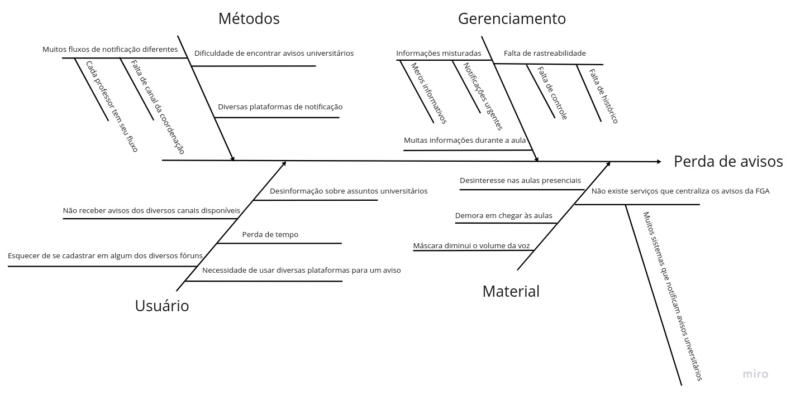

# Diagrama de causa e efeito

## Diagrama de Ishikawa

Diagrama de Ishikawa, também conhecido como diagrama espinha de peixe foi criado pelo engenheiro químico Kaoru Ishikawa, no ano de 1943. Seu sucesso na gestão da qualidade parte da motivação de Ishikawa ao criar a ferramenta. Seu projeto foi desenvolver uma ferramenta que fosse utilizável por qualquer pessoa, desde os colaboradores até a diretoria.

O diagrama de causa e efeito ou diagrama de Ishikawa é uma representação gráfica cuja função é auxiliar as análises da organização ou equipe na procura da causa de um problema.

O diagrama pode ser classificado em 6 tipos:

- Máquina
- Materiais
- Mão de obra
- Meio ambiente
- Medida
- Método

Nossa proposta foi procurar o que leva à perda de avisos e falta de comunicação entre a central acadêmica e os discentes. Portanto esse diagrama tem o objetivo de explorar as causas e diversos fatores que impossibilitam ou dificultam a comunicação, chegando assim no efeito, a perda de mensagens e avisos importantes. 

## Diagrama de Ishikawa - FGAvisos

## Referências

SERRANO, Milene. Causa-Efeito, 2021. Material apresentado na Disciplina de Arquitetura e Desenho de Software do curso de engenharia de software da UnB, FGA.

Andrade, Luiza. Metodologias de Gestão - Diagrama de Ishikawa. Disponível em: https://www.siteware.com.br/blog/metodologias/diagrama-de-ishikawa/

Grupo Forlogic. Diagrama de Ishikawa. Disponível em: https://ferramentasdaqualidade.org/diagrama-de-ishikawa/ 

## Versionamento

| Versão | Data       | Comentários                     | Autor(es)       
| ------ | ---------- | -----------------------------   | --------------- 
| 0.1    | 23/06/2022 | Criação do documento            | Vitor Diniz                                  
| 0.2    | 24/06/2022 | Adicionando texto e referência  | Vitor Diniz     
| 0.3    | 25/06/2022 | Adicionado especificação do diagrama em nosso escopo e imagem do diagrama | Mateus Moreira
| 0.4    | 25/06/2022 | Correção ortográfica corrigindo referência | Vitor Diniz
| 1.0    | 25/06/2022 | Finalizando Documento | Vitor Diniz
         
