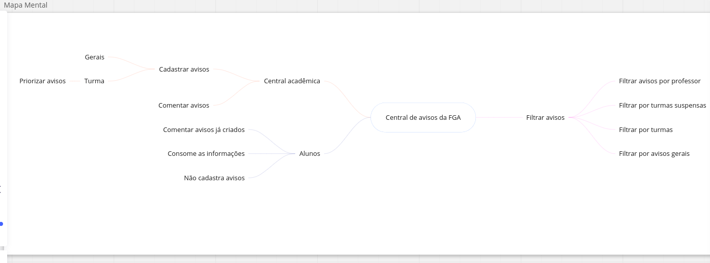

## Design Sprint

O termo Design Sprint é a combinação de duas palavras da lingua inglesa, em que design (remete a construção, desenho de um projeto) e sprint (remete a velocidade). Tal metodologia foi criada pela Google Ventures, para agilizar seus projetos. O funcionamento da metodologia é a junção de vários profissionais focados em avaliar e desenvolver um projeto em um curto espaço de tempo, são feitos a concepção, idealização, construção, antecipação de falhas e pontos de melhoria.

A metodologia divide-se em quatro etapas, sendo elas: Unpack (junção de ideias da equipe), Sketch (desenho das ideias apresentadas anteriormente), Decision(escolha da(s) melhor(es) ideia(s)) e Prototype (elaboração de um protótipo).

Com auxílio da ferramenta miro, conseguimos alinhar diversas ideias e realizar diversas metodologias para entendermos o que iremos desenvolver. Link para acesso a este documento [miro](https://miro.com/app/board/uXjVOrXcOYI=/?share_link_id=260970383105)

### 1. UNPACK - Debater aspectos e documentar com mapas mentais

Aqui foi feito com toda a equipe, em uma reunião do discord, diversas discussões para o entendimento do que iremos desenvolver. Para isto foi feito um mapa mental em grupo, com toda a equipe para alinharmos o que devemos fazer, ligar ideias e definir algumas funcionalidades do nosso sistema, o mapa mental deu inicio a um conjunto de atividades com a intenção de deixar a etapa UNPACK mais rica, utilizamos ferramentas complementares, como o 5W2H; é não é, faz, não faz. Visitar o [miro](https://miro.com/app/board/uXjVOrXcOYI=/?share_link_id=260970383105) para mais detalhe de imagem.

### 2. SKETCH - Modelar usando desenho (Ex: Rich Picture)

Para esta etapa, foi utilizado o processo rich picture. A ideia consiste em todos os membros colocar em um fluxo de desenho o que foi entendido no projeto, com a ideia de expor em mais baixo nível algumas funcionalidades e tipos de usuários. Logo após, fazer uma análise em grupo e decidir um rich picture final que expõe melhor a ideia geral do projeto. O print abaixo demonstra a área do quadro que todos colaboraram, para mais detalhe visite [miro](https://miro.com/app/board/uXjVOrXcOYI=/?share_link_id=260970383105).

### 3. DECISION - Escolher o melhor modelo dentre os feitos pelos membros

A partir das imagens geradas em reunião com a equipe, escolhemos uma imagem referência, a do Victor Hugo, que nos auxilio a levantar os requisitos da equipe. Para complementar esta etapa, foi utilizado uma técnica de brainstorm, para definir em mais baixo nível o backlog do nosso software. Isto resultou no backlog, padrão SAFe feito no zenhub, com Épicos, Features e Histórias de usuários com rastreamento, de acordo com o Moscow, [ZenHub](https://github.com/unbarqdsw2022-1/2022.1_g1_fgavisos#workspaces/time-de-engenheiros-62b3aa2dbcd7690018a4060e/board).

### 4. PROTOTYPE - Definir o prototipo para representar o software

Em nosso protótipo utilizamos como inspiração os sites utilizados pelos professores, como o aprender3, chegamos à um guia de identidade visual que tentasse compreender um contrast ratio mais alto, proporcionando mais comodidade aos usuários, em nosso guia de identidade compreendemos também a tipografia que foi utilizada a fonte Roboto para títulos, subtítulos e corpo de texto. Utilizamos as features e o backlog do produto para definir uma aproximação do resultado final da aplicação, compreendendo o funcionamento e o fluxo de todas as telas, porém ainda em evolução e validação.

O protótipo está disponível abaixo para visualização:

<iframe style="border: 1px solid rgba(0, 0, 0, 0.1);" width="800" height="650" src="https://www.figma.com/embed?embed_host=share&url=https%3A%2F%2Fwww.figma.com%2Ffile%2F5naphmEWK8aP5qRpFrcqhB%2FProt%25C3%25B3tipo-de-alta-fidelidade%3Fnode-id%3D0%253A1" allowfullscreen></iframe>

## Versionamento

| Data       | Versão |  Descrição         | Autor(es)                | Revisor         |
|:----------:|:------:| :-----------------:| :-----------------------------------------------------------------: | :-------------: |
| 25/06/2022 | 0.1   | Descrição do Design Sprint  | Hugo Rocha | Antonio Igor, Davi Marinho e Lameque Fernandes   |
| 26/06/2022 | 0.2    | Modularização do design sprint | Antonio Igor, João Coelho e Lameque Fernandes | Vitor Diniz |
| 27/06/2022 | 0.3    | Adicionando Decision | Deivid Carvalho | Mateus Moreira |
| 27/06/2022 | 0.4    | Adicionando Prototype | Mateus Moreira | Deivid Carvalho |