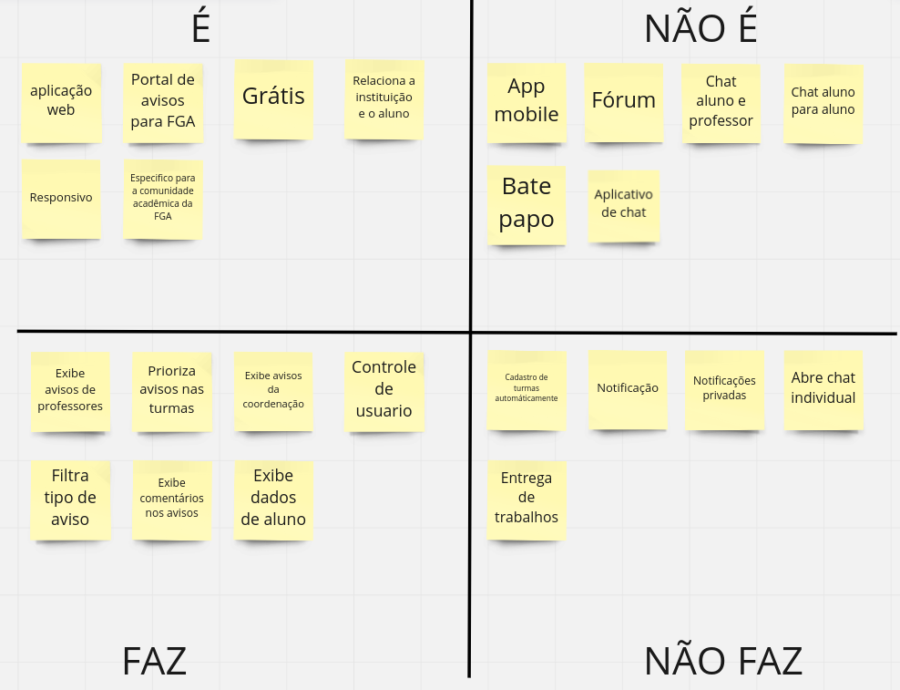

## 2 - É, não é, faz, não faz

Essa metodologia auxiliou a equipe para garantirmos que no momento de definirmos as funcionalidades, não houvesse má compreensão do que nosso software deseja entregar. Ela consiste em escrever em cartões o que nosso software é, o que ele não é, o que ele faz e o que ele não irá fazer jamais. A seguir um print do esboço feito pela equipe, para ver com detalhes [miro](https://miro.com/app/board/uXjVOrXcOYI=/?share_link_id=260970383105).

## Versionamento

| Data       | Versão |  Descrição                                  | Autor(es)        | Revisor          |
|:----------:|:------:| :------------------------------------------:| :--------------: | :-------------:  |
| 22/06/2022 | 0.1    | Criação da Estimativa de Custos e Esforços  | Antonio Igor, Antonio Rangel, Davi Marinho, Deivid Alves, João Coelho, Lameque Fernandes, Mateus Moreira, Victor Hugo e Vitor Diniz | Todos os membros |
| 26/06/2022 | 0.2    | Modularização é, não é, faz, não | Antonio Igor, João Coelho e Lameque Fernandes | .... |