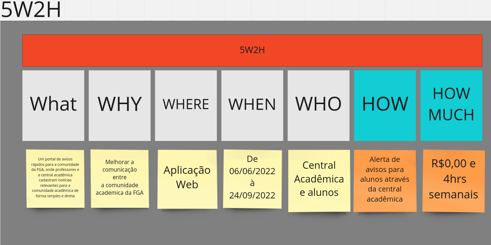

## 1. 5W2H

O intuito é expor os objetivos do software, descrevendo o que é, a motivação de sua existência, ambiente de construção, período de construção, usuários, como será resolvido o problema proposto e quanto custará. O print abaixo expoe um panorama do que foi feito, para detalhes [miro](https://miro.com/app/board/uXjVOrXcOYI=/?share_link_id=260970383105).

## Versionamento

| Data       | Versão |  Descrição                                  | Autor(es)        | Revisor          |
|:----------:|:------:| :------------------------------------------:| :--------------: | :-------------:  |
| 22/06/2022 | 0.1    | Criação da Estimativa de Custos e Esforços  | Todos os membros | Todos os membros |
| 26/06/2022 | 0.2    | Modularização 5W2H | Antonio Igor, João Coelho e Lameque Fernandes | Vitor Diniz |
