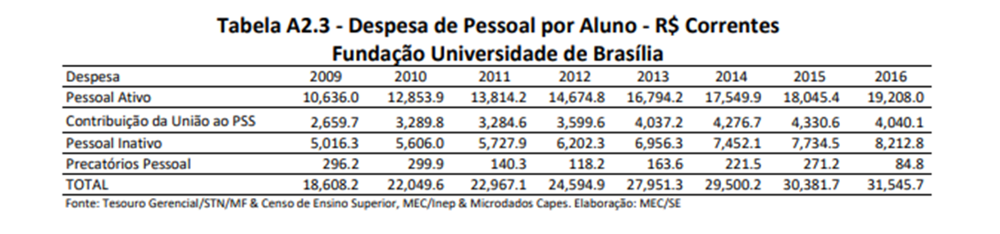
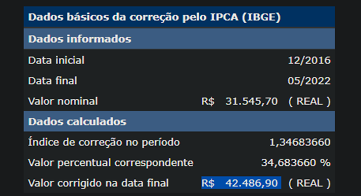

## Estimativas de Custos e Esforços

### 1. Introdução

A estimativa de custos e esforços consiste em uma aproximação dos custos monetários em relação ao tempo de desenvolvimento necessários para completar as atividades do projeto FGAvisos. Nesse documento visamos estimar o valor monetário implícito que será gasto ao longo do semestre para as atividades de desenvolvimento do projeto.

### 2. Estimativas

#### 2.1 Mão de obra

Para calcular o custo da mão de obra, utilizamos como base o custo de um aluno para a Universidade de Brasília, conseguimos essa informação através de uma nota técnica produzida pelo MEC em fevereiro de 2018, nesta nota o custo total por aluno da Universidade de Brasília foi de R$ 31.545,7 para o ano de 2016.

  Imagem 1 - Custo de um aluno para a Universidade de Brasília em 2016

Estes dados foram estabelecidos com base no ano de 2016, para se ter uma media para 2022 precisamos corrigir o valor de acordo com a inflação desse período, ao realizar esse cálculo como consta na imagem 2, o valor de R$ 31.545,7 na data 12/2016 seria equivalente a R$ 42.486,90 em 05/2022, com isso estimamos um novo valor para o custo atual de um aluno da Universidade de Brasília em maio de 2022 de acordo com a taxa de juros do Índice Nacional de Preços ao Consumidor Amplo (IPCA).

  Imagem 2 - Correção de Valores

Com isso temos um custo mensal aproximado de R$ 3.540,58 por aluno, então o custo de um semestre com duração de 3 meses seria de R$ 10.621,74 por aluno. 

No grupo possuímos 10 integrantes, então o custo estimado da mão de obra desses alunos durante todo o período de desenvolvimento do projeto seria de R$ 106.217,4.

#### 2.2 Equipamentos

Por se tratar de uma atividade de desenvolvimento de software, consideramos que o equipamento necessário nesse contexto seria um notbook com configurações atuais. Um modelo compatível seria o Notebook Asus Intel Core I7-1165g7 8gb 256gb Ssd W11 15,6", que poderia ser adquirido pelo valor de R$3.959,98 na data de 23/06/2022 na loja virtual Submarino, totalizando R$ 39.599,80 em equipamentos para os 10 membros.

#### 2.3 Ferramentas

As ferramentas necessárias para o desenvolvimento do projeto serão gratuitas:
- Sistemas operacionais que utilizam o Kernel Linux
- Git e GitHub como ferramentas de versionamento de código
- ZenHub para centralizar as issues referentes ao desenvolvimento
- WhatsApp e Telegram para comunicação por texto de forma remota
- Discord para comunicação em tempo real
- Trello para organização de atividades

#### 2.4 Custos totais

Somando todos os custos levantados temos um total de R$ 145.817,20.

### 3. Referências
 
> PATRÍCIO, Luciano. Apuração do custo das Universidades Federais, e sua relação com os respectivos quantitativos de alunos. Disponível em: <http://forplad.andifes.org.br/sites/default/files/forplad/comissaoplanejamento/NT_04-2018_e_anexos_-_apura%C3%A7%C3%A3o_do_custo_das_universidades.pdf/>

> Calculadora do Cidadão. Disponível em <https://www3.bcb.gov.br/CALCIDADAO/publico/corrigirPorIndice.do?method=corrigirPorIndice>

### Versionamento

| Data       | Versão |  Descrição         | Autor(es)                | Revisor         |
|:----------:|:------:| :-----------------:| :-----------------------------------------------------------------: | :-------------: |
| 25/06/2022 | 0.1    | Criação do documento | Antonio Igor e Davi Marinho  | Lameque Fernandes e Hugo Rocha |
| 26/06/2022 | 0.2    | Modularização estimativa de custo | Antonio Igor, João Coelho e Lameque Fernandes | Vitor Diniz |
| 26/06/2022 | 0.3    | Atualização do conteúdo e formatação do documento | Antonio Igor  | Vitor Diniz |