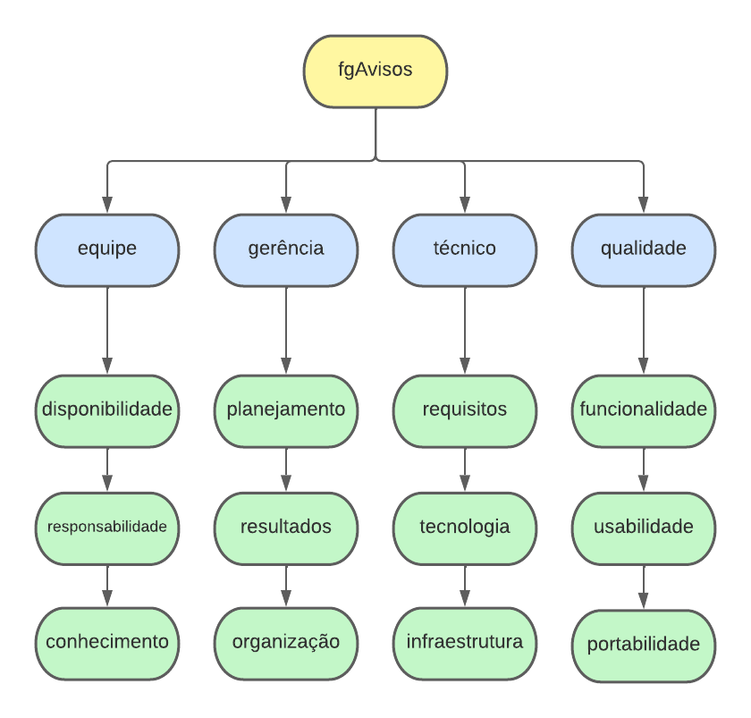

## Gerenciamento de Riscos

### 1. Introdução

Os riscos do projeto são possíveis infortúnios que podem ocorrem enquanto o projeto está em andamento, tais empecilhos podem acabar atrapalhando o planejamento do projeto e possíveis metas. Para contornar e resolver estes problemas é necessário que a equipe saiba identificar esses riscos e o impacto que eles podem promover ao produto e desenvolvimento. 

### 2. Estrutura Análitica de Riscos (EAR)

#### 2.1 Representação EAR

#### 2.2 Descrição dos Itens da EAR

##### Equipe

- Disponibilidade: Corresponde aos riscos relacionados a disponibilidade de horários dos membros durante o desenvolvimento do projeto.

- Responsabilidade: É relativo ao risco referente a responsabilidade individual dos membros, no qual pode acontecer de uma tarefa ser destinada a alguém e este não a finalizar por falta de responsabilidade.

- Conhecimento: Riscos referentes ao conhecimento dos membros em relação as técnicas e tecnologias que serão utilizadas ao longo do projeto.

##### Gerência

- Planejamento: São riscos relacionados a erros provenientes do planejamento, como tarefas demais definidas para um curto período de tempo.

- Resultados: São riscos que correspondem aos resultados obtidos, como resultados que podem ser considerados insatisfatórios para o que foi planejado.

- Organização: Riscos referentes a organização da equipe, como uma tarefa simples ser designada para várias pessoas e uma atividade complexa para um membro.

##### Técnico

- Requisitos: Riscos relacionados aos requisitos levantados e ao escopo definido.

- Tecnologia: É relativo a riscos relacionados às tecnologias e ferramentas utilizadas para o desenvolvimento do projeto.

- Infraestrutura: Riscos relacionados à infraestrutura onde o software será executado.

##### Qualidade

- Funcionalidade: Contempla os riscos relacionado à funcionalidade do software, como garantir que os requisitos foram concluídos da forma correta, garantir que o software final reflete no que foi planejado e que a supri as demandas pré-definidas.

- Usabilidade: A usabilidade engloba todos os aspectos referentes à interface com o usuário, que o público se sinta familiarizado com o sistema e o ache de fácil uso.

- Portabilidade: Se refere a que plataformas o software irá funcionar de forma aceitável.

### 3. Métricas

Para obter a relevância de cada risco, dois fatores serão considerados, sendo eles:

- Probabilidade: A probabilidade representa a chance (%) desse risco ocorrer, tal indicação é feita em cada sprint.

- Impacto: O impacto representa o prejuízo que cada risco oferece ao projeto caso ocorra.

Abaixo, foi representado como foi feita a estimação de cada fator e o que ela representa.

| Impacto       | Descrição                                                                            | Valor |
| ------------- | ------------------------------------------------------------------------------------ | ----- |
| Nenhum        | Nenhum impacto                                                                       | 0     |
| Muito pequeno | Praticamente sem impactos ao projeto                                                 | 1     |
| Pequeno       | Impacto pequeno ao projeto                                                           | 2     |
| Médio         | Impacto que começa a apresentar algumas consequências ao projeto                     | 3     |
| Alto          | Impacto que compromete o andamento saudável do projeto                               | 4     |
| Altíssimo     | Impacto que inviabiliza o andamento do projeto caso não seja corrigido ou minimizado | 5     |

 

| Probabilidade  | Descrição                               | Valor |
| -------------- | --------------------------------------- | ----- |
| Nenhum        		| Nenhuma chance de acontecer             | 0     |
| Improvável    	    | Menor que 20% de chance de acontecer    | 1     |
| Pouco Provável	    | Entre 21% e 40% de chance de acontecer  | 2     |
| Provável      	    | Entre 41% e 60% de chance de acontecer  | 3     |
| Muito provável	    | Entre 61% e 80% de chance de acontecer  | 4     |
| Extremamente provável | Entre 81% e 100% de chance de acontecer | 5     |

Esses valores serão utilizados para a criação das matrizes de impacto.

### 4.  Matrizes de impacto

#### Riscos de equipe

| Risco   | Impacto | Probabilidade | Ação preventiva | Ação reativa |
| ------- | ------- | ------------- | --------------- | ------------ |
| Disponibilidade dos membros da equipe | Alto | Provável | Criação da tabela de horário dos membros | Designação de um membro disponível para as tarefas do indisponível | 
| Responsabilidade | Alto | Improvável | Conscientização dos membros da importância da responsabilidade e comprometimento individual | Designação da tarefa imcompleta para outro membro da equipe | 
| Conhecimento da equipe | Médio | Improvável | Definição das tecnologias antecipadamente para permitir a capacitação adiantada dos membros | Contactar membros experientes na tecnologia para ajudar e tirar dúvidas |

#### Riscos de gerência

| Risco   | Impacto | Probabilidade | Ação preventiva | Ação reativa |
| ------- | ------- | ------------- | --------------- | ------------ |
| Planejamento da sprint | Alto | Pouco Provável | Realizar o planejamento em grupo para ter diferentes visões do planejamento | Realizar um novo planejamento | 
| Finalização insatisfatória de tarefas | Altíssimo | Provável | Todo o desenvolvimento deve passar por um pull request para que seja revisado pelos outros membros | Avaliar o impacto e então decidir o que deverá ser feito | 
| Definição da complexidade de uma tarefa | Pequeno | Provável | Realizar planning poker com toda a equipe para estimar a complexidade de uma tarefa | Informar os membros do grupo caso perceba uma discrepância entre o estimado e a realidade | 

#### Riscos técnicos

| Risco   | Impacto | Probabilidade | Ação preventiva | Ação reativa |
| ------- | ------- | ------------- | --------------- | ------------ |
| Requisito mal definido | Alto | Provável | Revisar os requisitos levantados | Refinar e replanejar os requisitos | 
| Comportamento inesperado das tecnologias | Alto | Improvável | Definir tecnologias nas quais os membros possuam algum tipo de conhecimento | Pedir ajuda aos membros da equipe com maior domínio na tecnologia | 
| Falta ou falha de equipamentos | Alto | Pouco Provável | Manutenção do equipamento a ser utilizado durante a disciplina | Pareamento através de chamadas de vídeo | 

#### Riscos de qualidade

| Risco   | Impacto | Probabilidade | Ação preventiva | Ação reativa |
| ------- | ------- | ------------- | --------------- | ------------ |
| Falhas e bugs na aplicação | Altíssimo | Muito Provável | Realização de testes de inspeção e verificação nos códigos adicionados ao repositórios | Refatoração do código defeituoso | 
| Portabilidade | Pequeno | Pouco Provável | Criar uma aplicação web responsiva | Reavaliar a responsividade da página e propor soluções | 

### 4. Burndown de Riscos

Os riscos serão pontuados em todas as sprints do projeto em relação à probabilidade e impacto, em uma planilha. Após pontuados, serão gerados gráficos de Burndown de Riscos, sendo um geral, onde podemos ver somatório de todos os riscos do projeto por sprint e também um individual de cada risco, onde podemos ver o andamento de um risco específico ao longo das sprints do projeto. 
Com essas informações podemos identificar como a equipe está lidando com os riscos e verificar se os valores dos riscos estão diminuindo individualmente. 
A cada sprint o Burndown de Riscos será atualizado.

<iframe width="957" height="591" seamless frameborder="0" scrolling="no" src="https://docs.google.com/spreadsheets/d/1RavsVkIaQfk4Hiu5DfVm6MQAbee1G3QW1pGEz-SyC7I/edit#gid=1789806027"></iframe>

Para ver os detalhes de cada risco e os gráficos individuais, acesse a [planilha de riscos](https://docs.google.com/spreadsheets/d/1RavsVkIaQfk4Hiu5DfVm6MQAbee1G3QW1pGEz-SyC7I/edit?usp=sharing).

### Versionamento

| Data       | Versão |  Descrição         | Autor(es)                | Revisor         |
|:----------:|:------:| :-----------------:| :-----------------------------------------------------------------: | :-------------: |
| 25/06/2022 | 0.1    | Criação do Gerenciamento de Riscos  | Antonio Igor e Lameque Fernandes      | Davi Marinho |
| 25/06/2022 | 0.2    | Revisão e complemento do gerenciamento de riscos  | Davi Marinho      |  João Coelho |
| 26/06/2022 | 0.3    | Modularização do gerenciamento de riscos | Antonio Igor, João Coelho e Lameque Fernandes | Vitor Diniz |
| 26/06/2022 | 0.4    | Atualização na organização e conteúdo do documento  | Antonio Igor | .... |
| 26/06/2022 | 0.5    | Criação do EAR  | Antonio Igor | .... |
| 14/07/2022 | 0.6    | Criação do planilha para o burndown de riscos  | Antonio Igor | .... |

