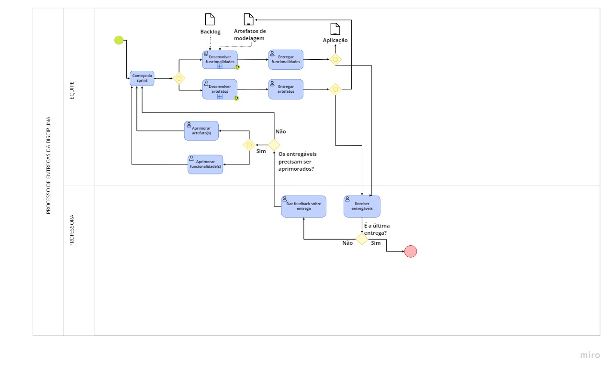

## 1. Introdução
BPMN (Business Process Model and Notation) é uma notação gráfica que tem o propósito de padronizar o mapeamento dos processos de uma organização ou negócio através de uma gramática de símbolos.

Na modelagem BPMN, um processo de negócio é representado pelo encadeamento de **atividades** e **eventos**, ligados através de **conectores** que demonstram a sequência em que os mesmos são realizados. Além de **eventos** e **atividades**, outros elementos de controle de fluxo podem ser utilizados na modelagem como: **gateways**, **subprocessos**, **artefatos**, etc. Eles permitem a criação ou unificação de fluxos paralelos que ocorram no decorrer de um mesmo processo de negócio e são feitos por um ou mais **papéis internos**.

## 2. Diagramas usando a notação BPMN

Figura 1 - Diagrama Geral 

 

Figura 2 - Subprocesso de desenvolver 

 

Figura 3 - Subprocesso de desenvolver artefatos  

 

## 3. Referências
SGANDERLA, K. Um guia para iniciar estudos em BPMN (I): Atividades e sequência. Disponível em: http://blog.iprocess.com.br/2012/11/um-guia-para-iniciar-estudos-em-bpmn-i-atividades-e-sequencia/. Acessado em: 26 de jun de 2022.
## 4. Versionamento
| Data       | Versão |  Descrição                                  | Autor(es)        | Revisor          |
|:----------:|:------:| :------------------------------------------:| :--------------: | :-------------:  |
| 26/06/2022 | 0.1    | Criação do documento  | Antonio Rangel, Vítor Diniz | Antonio Igor |
| 26/06/2022 | 0.2    | Adicionando texto e referência  | Antonio Rangel, Vítor Diniz | Antonio Igor |
| 26/06/2022 | 0.3    | Adicionando diagrama BPMN e subprocesso  | Antonio Rangel, Vítor Diniz | Antonio Igor |
| 26/06/2022 | 1.0    | Finalizando documento  | Antonio Rangel, Vítor Diniz | Antonio Igor |
| 26/06/2022 | 1.1    | Consertanto nome e atualizando diagramas  | Antonio Rangel | Vitor Diniz |
