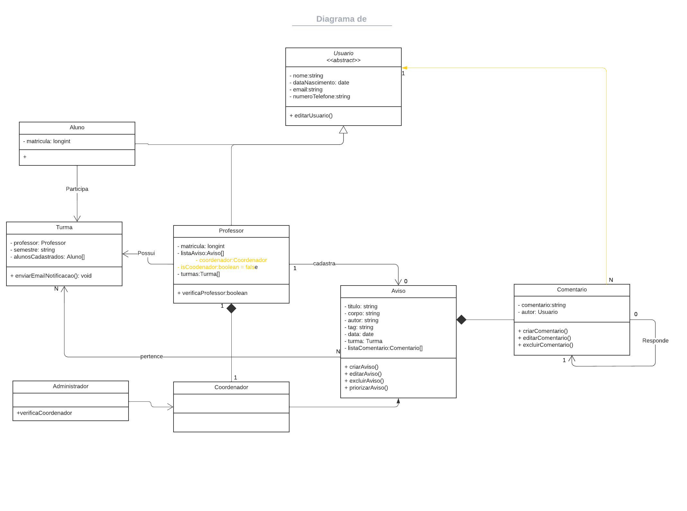
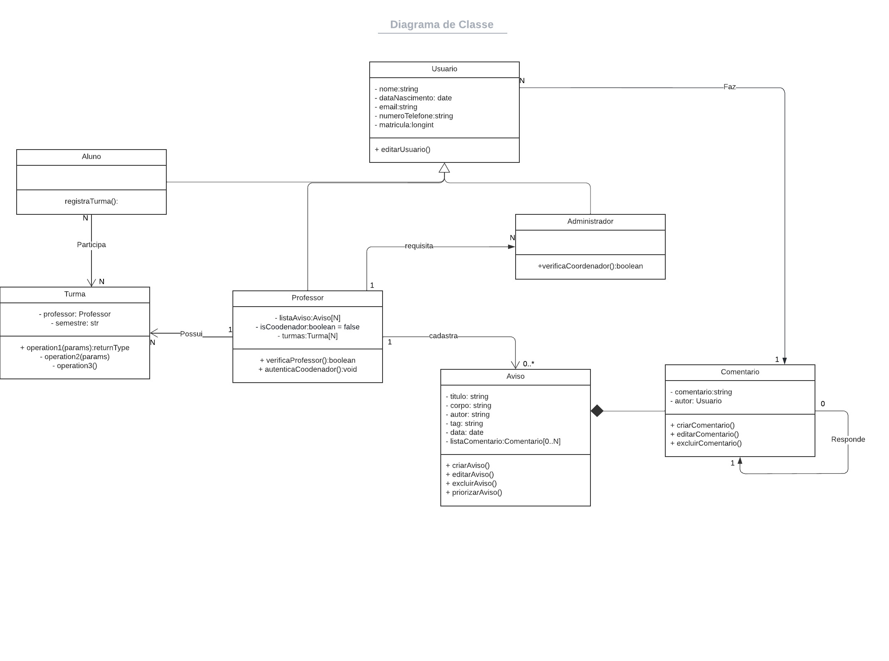

# Diagrama de Classes

## Introdução

O Diagrama de Classes tem como objetivo mapear a estrutura de um sistema, modelando suas classes, atributos, métodos e relações entre os objetos. Esses componentes do diagrama de classes podem representar as classes que serão programadas, os principais objetos e/ou as interações entre as classes e os objetos.

O diagrama foi produzido usando o Lucid Chart e inicialmente foi feito em grupo por conta que o time entendeu que ele é uma base para começar os outros diagramas. Nele é contido as classes do nosso sistema contendo seus atributos e métodos, sendo ocultado os métodos auxiliares, além de seus relacionamentos.

O grupo entendeu que o diagrama de classe é muito importante para a implementação e para iniciar os outros diagramas, por isso ele foi o primeiro a ser feito e quase todo o grupo participou de sua eloboração inicial. Foi de grande ajuda pra entender até mesmo o nosso produto.

## Diagrama de comunicação - FGAvisos

### Versão 1

### Versão 2

### Versão 3

## Referências

> SERRANO, Milene. Diagrama de classes, 2020. Material apresentado na Disciplina de Arquitetura e Desenho de Software do curso de engenharia de software da UnB, FGA.

> O que é um diagrama de classe em UML? Lucidchart, Disponivel em: <https://www.lucidchart.com/pages/pt/o-que-e-diagrama-de-classe-uml>. Acesso em: 07/07

## Versionamento

| Data  | Versão |                     Descrição                      |  Autor(es)  | Revisor |
| :---: | :----: | :------------------------------------------------: | :---------: | :-----: |
| 07/07 |  0.1  | Elaboração inicial do diagrama de classe                              | Antonio Igor, Antonio Rangel, Davi Marinho,  Deivid Carvalho, João Coelho, Lameque Fernandes, Mateus M, Victor Hugo |  xxxx  |
| 13/07 |  0.2  |               Abertura do documento                                   | Davi Marinho |  xxxx  |
| 13/07 |  0.3  |          Adiciona a Introdução do documento                           | Davi Marinho |  xxxx  |
| 13/07 |  0.4  |    Adiciona a primeira referencia do documento                        | Davi Marinho |  xxxx  |
| 13/07 |  0.5  |   Adiciona a primeira versão do diagrama de classe                    | Davi Marinho |  xxxx  |
| 13/07 |  0.6  |   Elaboração da segunda e terceira versão do diagrama  de classe      | Davi Marinho |  xxxx  |
| 13/07 |  0.7  |  Adiciona a segunda e terceira versão do diagrama de classe           | Davi Marinho, Deivid Carvalho, João Coelho, Lameque Fernandes,  Mateus M |  xxxx  |
| 13/07 |  0.8  |          Finalizando o documento do diagrama de classe                | Davi Marinho |  xxxx  |

