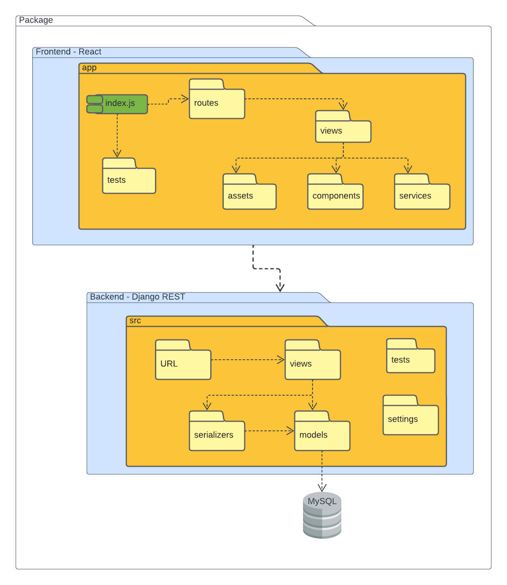

# Diagrama de Pacotes

## 1. Introdução
Diagrama de pacote é um diagrama de estrutura UML que descreve a estrutura do sistema projetado no nível de pacotes[1]. São comumente usados para simplificar os diagramas de classe complexos e organizar as classes em pacotes, oferecendo uma valiosa visibilidade de alto nível para grandes projetos e sistemas[2]. Um pacote é um agrupamento de elementos UML relacionados, como diagramas, documentos, classes ou até mesmo outros pacotes. Portanto, diagramas de pacotes são usualmente utilizados em diagramas de casos de uso, de classes e também podem ser usados junto com diagramas de modelos, que são tipos de diagramas de estrutura auxiliar UML usados para mostrar os aspectos lógicos, comportamentais ou estruturais de um sistema.[3].

Nesse projeto, a utilização desse diagrama visa apresentar de forma clara a aquitetura de pacotes que serão usadas no desenvolvimento, apresentando os componentes, interfaces e dependências do software. Neste documento mostra ainda, a aquitetura do frontend(a camada de contato com o usuário), que será desenvolvido com a biblioteca ReactJS. A arquitetura do backend(bastidores das funcionalidades das aplicações), desenvolvido com Django Rest, e para a persistência dos dados utilizaremos o banco MySQL. 

O desenvolvimento desse diagrama foi feito pela ferramenta [LucidChart](https://www.lucidchart.com/pages/pt).

## 2. Diagrama de Pacotes

<h4 align = "center">Figura 1: Diagrama de pacotes</h6>
<h4 align = "center">Fonte: Autores</h6>

## 3. Referências
> [1] **UML Package Diagram Overview**. Disponível em: <a href="https://www.uml-diagrams.org/package-diagrams-overview.html" target="_blanck">https://www.uml-diagrams.org/package-diagrams-overview.html</a>. Acesso em: 11 de jul. de 2022.

> [2] **Diagrama de Pacotes: Definição, Componentes e Exemplos**. Disponível em: <a href="https://gitmind.com/pt/diagrama-de-pacotes.html" target="_blanck">https://gitmind.com/pt/diagrama-de-pacotes.html</a>. Acesso em: 11 de jul. de 2022.

> [3] **Tudo sobre diagramas de pacotes UML**. Lucidchart. Disponível em: <a href="https://www.lucidchart.com/pages/pt/diagrama-de-pacotes-uml" target="_blanck">https://www.lucidchart.com/pages/pt/diagrama-de-pacotes-uml</a>. Acesso em: 11 de jul. de 2022.

## Versionamento

| Data |Versão| Descrição | Autor(es) | Revisor |
|:----:|:----:|:---------:|:-----:|:-----:|
| 11/07 |  0.1  | Criação do diagrama de pacotes | Victor Hugo | xxxx |