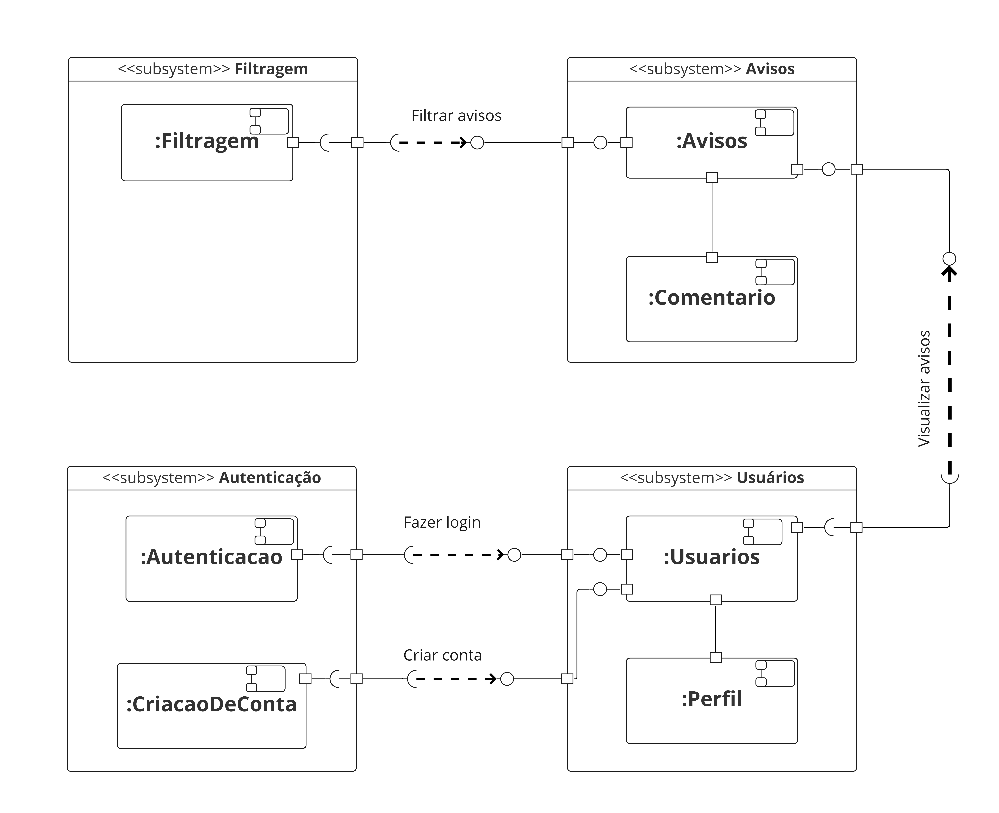

# Diagrama de Componentes

## 1. Introdução
O diagrama de componentes mostra o relacionamento entre diferentes componentes de um sistema[1]. Componente é o módulo de classes que representa sistemas ou subsistemas independente que podem interagir com o restante do sistema, e podem ser reutilizados ou substituídos caso seja necessário.

## 2. Diagrama de Componentes
### 2.1 Primeira versão do Diagrama de Componentes

<h4 align = "center">Figura 1: Primeira versão</h6>
<h4 align = "center">Fonte: Autores</h6>

### 2.2 Segunda versão do Diagrama de Componentes
Após mostrar a primeira versão para a Professora Milene e coletar um *feedback* sobre o mesmo, melhorias foram feitas como: o componente perfil virou um subsistema que contém os quatro perfis do sistema fgAvisos, a conexão entre componentes dentro do mesmo sistema deve ser a de conector *assembly*, pois um requer a interface do outro [2] e o título do subsistema que era **"Autenticação"** passou a ser **"Contas"** para generalizar.

<h4 align = "center">Figura 2: Segunda versão</h6>
<h4 align = "center">Fonte: Autores</h6>

## 3. Referências
> [1] **Diagrama de componentes UML: o que é, como fazer e exemplos**. Disponível em: <a href="https://www.lucidchart.com/pages/pt/diagrama-de-componentes-uml" target="_blanck">https://www.lucidchart.com/pages/pt/diagrama-de-componentes-uml</a>. Acesso em: 14 de jul. de 2022.

> [2] **UML Connector** Disponível em: <a href="https://www.uml-diagrams.org/composite-structure-diagrams/connector.html" target="_blanck">https://www.uml-diagrams.org/composite-structure-diagrams/connector.html</a>. Acesso em: 14 de jul. de 2022.
## Versionamento
| Data |Versão| Descrição | Autor(es) | Revisor |
|:----:|:----:|:---------:|:-----:|:-----:|
| 14/07 |  0.1  | Primeira versão do Diagrama de Componentes | Antonio Rangel | Deivid Carvalho e Lameque Fernandes |

