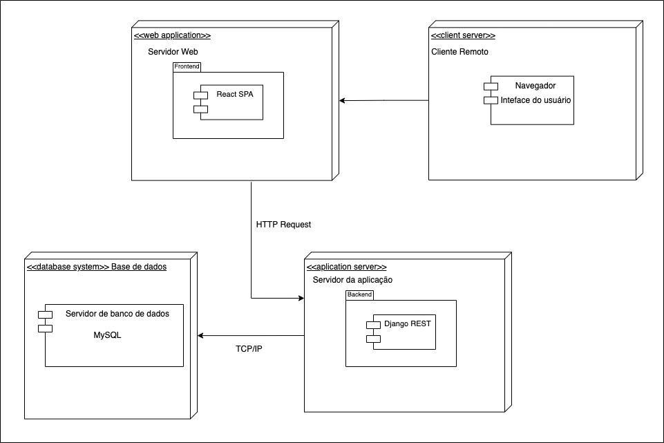
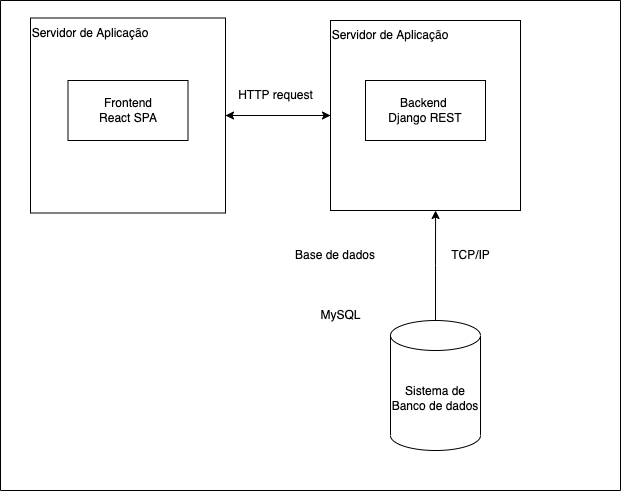

# Diagrama de Implementação

## Introdução

Na UML, os diagramas de implementação _(deployment diagram)_ modelam a arquitetura física de um sistema. Os diagramas de implementação mostram os relacionamentos entre os componentes de software e hardware no sistema e a distribuição física do processamento.
Os diagramas de implementação, que normalmente são preparados durante a fase de desenvolvimento da implementação, mostram a organização física dos nós em um sistema distribuído, os artefatos que estão armazenados em cada nó e os componentes e outros elementos que os artefatos implementam. Os nós representam dispositivos de hardware como por exemplo servidores, sensores e impressoras, bem como outros dispositivos que suportam o ambiente de tempo de execução de um sistema. Caminhos de comunicação e relacionamentos de implementação modelam as conexões do sistema.

Os diagramas de implementação são eficazes para visualizar, especificar e documentar os seguintes tipos de sistemas:

- Sistemas incorporados que utilizam hardware que é controlado por estímulo externo; por exemplo, um vídeo que é controlado pela alteração de temperatura
- Sistemas cliente/servidor que normalmente distinguem entre a interface com o usuário e os dados persistentes de um sistema
- Sistemas distribuídos que possuem vários servidores e podem hospedar diversas versões de artefatos de software, alguns dos quais podem até migrar de um nó para outro

Como os diagramas de implementação se concentram na configuração dos nós de processamento de tempo de execução e de seus componentes e artefatos, é possível utilizar esse tipo de diagrama para avaliar as implicações da distribuição e de alocações de recursos.

Os seguintes tópicos descrevem elementos de modelos em diagramas de implementação:

- Nós nos Modelos UML

  - Nos modelos UML, os nós são elementos de modelo que representam os recursos computacionais de um sistema, como por exemplo computadores pessoais, sensores, dispositivos de impressão ou servidores. Os nós podem ser conectados por caminhos de comunicação, para descrever estruturas de rede.

- Instâncias do Nó

  - Na modelagem UML, uma instância de nó é um elemento de modelo que representa uma instanciação, ou uma ocorrência real, de um nó. As instâncias de nó baseiam-se nos nós existentes.

- Ambientes de Execução

  - Em modelagem UML, um ambiente de execução é um tipo de nó que representa uma plataforma de execução específica, como um sistema operacional ou um sistema de gerenciamento de banco de dados. É possível utilizar os ambientes de execução para descrever o contexto no qual a execução de um modelo ocorre.

- Artefatos

  - Em modelos UML, artefatos são elementos de modelo que representam as entidades físicas em um sistema de software. Os artefatos representam unidades físicas de execução, como por exemplo arquivos executáveis, bibliotecas, componentes de software, documentos e bancos de dados.

- Instâncias do Artefato

  - Em modelagem UML, uma instância do artefato é um elemento de modelo que representa uma instanciação ou uma ocorrência real de um artefato. As instâncias do artefato baseiam-se nos artefatos existentes.

- Dispositivos

  - Em diagramas de implementação, um dispositivo é um tipo de nó que representa um recurso computacional físico em um sistema, como um servidor de aplicativos.

- Especificações de Implementação

  - Uma especificação de implementação é basicamente um arquivo de configuração, como um documento XML ou um arquivo de texto, que define como um artefato é implementado em um nó.

- Relacionamentos em Diagramas de Implementação
  - Na UML, um relacionamento é uma conexão entre elementos de modelo. Um relacionamento UML é um tipo de elementos de modelo que inclui semântica em um modelo, definindo a estrutura e o comportamento entre os elementos de modelo.

## Objetivo

Uma vez que a aplicação que será desenvolvida envolve vários sistemas de software independentes (sistemas gerenciadores de banco de dados, back-end, front-end, dentre outros), e são tais sistemas que utilizam plataformas de hardware dedicadas, é importante compreender as características dessas plataformas, assim como o modo de como a comunicação será feita.

Desse modo, o grupo elaborou um diagrama de implementação que irá ajudar a compreender o modo de como todos esses componentes interagem entre si, compondo a aplicação.

## Diagrama de Implementação - FGAvisos

### Versão 2

### Versão 1

## Referências

> Diagramas de Implementação. **IBM**. Disponível em: https://www.ibm.com/docs/pt-br/rsas/7.5.0?topic=topologies-deployment-diagrams

> O que é um diagrama de implementação? **Lucidchart**. Disponível em: https://www.lucidchart.com/pages/pt/o-que-e-diagrama-de-implementacao-uml

## Versionamento

| Data  | Versão |                      Descrição                       |  Autor(es)  |   Revisor                        |
| :---: | :----: | :--------------------------------------------------: | :---------: | :------------------------------: |
| 07/07 |  0.1   | Estudos para elaboração do diagrama de implementação | Vitor Diniz | Davi Marinho                     |
| 08/07 |  0.2   |                Abertura do documento                 | Vitor Diniz | Davi Marinho                     |
| 08/07 |  0.3   |         Elaboração da introdução e objetivo          | Vitor Diniz | Davi Marinho                     |
| 09/07 |  0.4   |                Elaboração do diagrama                | Vitor Diniz | Davi Marinho                     |
| 09/07 |  0.5   |               Adicionando referências                | Vitor Diniz | Davi Marinho                     |
| 09/07 |  0.6   |        Adicionando diagrama de implementação         | Vitor Diniz | Davi Marinho                     |
| 12/07 |  0.7   |    Adicionando diagrama de implementação versão 2    | Vitor Diniz | Davi Marinho                     |
| 12/07 |  1.0   |                Finalizando documento                 | Vitor Diniz | Davi Marinho                     |
| 12/07 |  1.1   |              Correção diagrama versão 2              | Vitor Diniz | Davi Marinho                     |
| 13/07 |  1.2   |                 Revisão do documento                 | Vitor Diniz | Davi Marinho                     |
| 15/07 |  1.3   |        Corrigindo diagrama e nome do arquivo         | Vitor Diniz | Davi Marinho e Lameque Fernandes |
