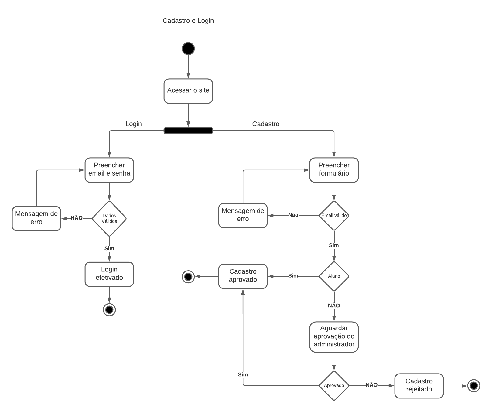
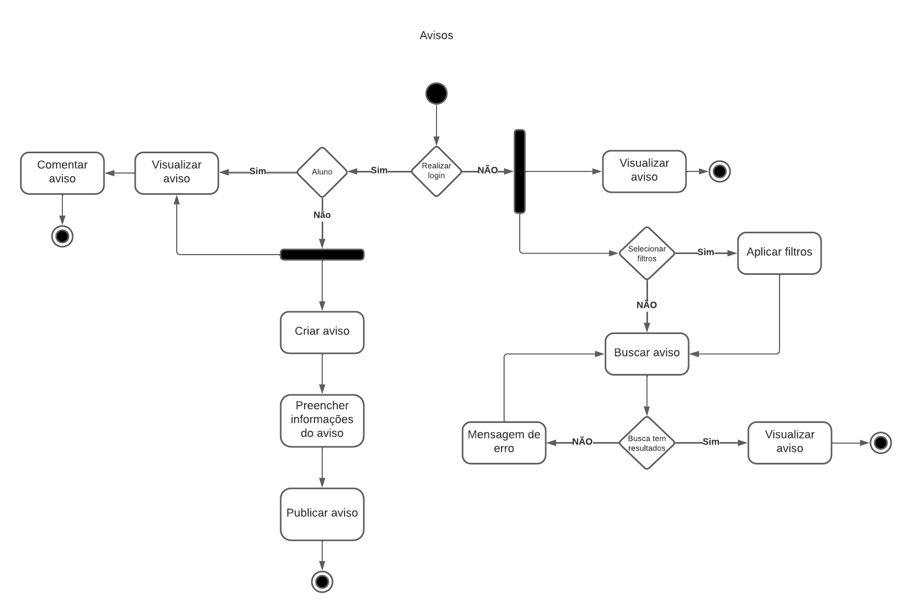

# Diagrama de atividades

## 1. Introdução
O diagrama de atividades é um diagrama de comportamento UML que mostra o fluxo de controle ou fluxo de objetos com ênfase na sequência e nas condições do fluxo [1]. As partes interessadas lidam com muitas questões, portanto, é importante se comunicar com clareza e concisão. Diagramas de atividade ajudam a unir as pessoas das áreas de negócios e de desenvolvimento de uma organização para entender o mesmo processo e comportamento [3].

## 2. Diagrama de Atividades

### 2.1 Diagrama de Cadastro e Login

<h4 align = "center">Figura 1: Diagrama de cadastro e login</h6>
<h4 align = "center">Fonte: Autores</h6>

### 2.2 Diagrama de Avisos

<h4 align = "center">Figura 2: Diagrama de avisos</h6>
<h4 align = "center">Fonte: Autores</h6>

## 3. Referências

> [1] **UML Package Diagram Overview**. Disponível em: <a href="https://www.uml-diagrams.org/activity-diagrams.html" target="_blanck">https://www.uml-diagrams.org/activity-diagrams.html</a>. Acesso em: 12 de jul. de 2022.

> [2] **SERRANO, Milene**. Diagrama de atividades, 2020. Material apresentado na Disciplina de Arquitetura e Desenho de Software do curso de engenharia de software da UnB, FGA.

> [3] **O que é diagrama de atividades UML?**. Disponível em: <a href="https://www.lucidchart.com/pages/pt/o-que-e-diagrama-de-atividades-uml" target="_blanck">https://www.lucidchart.com/pages/pt/o-que-e-diagrama-de-atividades-uml</a>. Acesso em: 12 de jul. de 2022.

## Versionamento

| Data |Versão| Descrição | Autor(es) | Revisor |
|:----:|:----:|:---------:|:-----:|:-----:|
| 10/07 |  1.0  | Primeira versão do diagrama de atividades | Antonio Igor | - |
| 11/07 |  2.0  | Segunda versão dos diagramas de atividades  | Antonio Igor | - |
| 11/07 |  2.1  | Adição das referências | Antonio Igor | - |