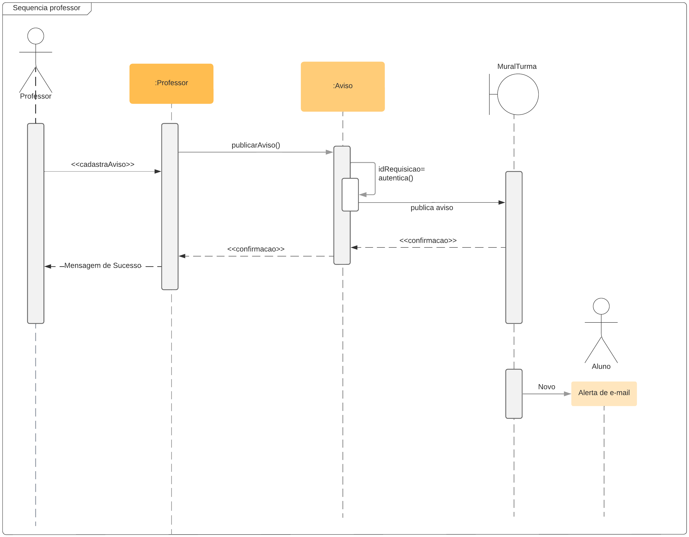
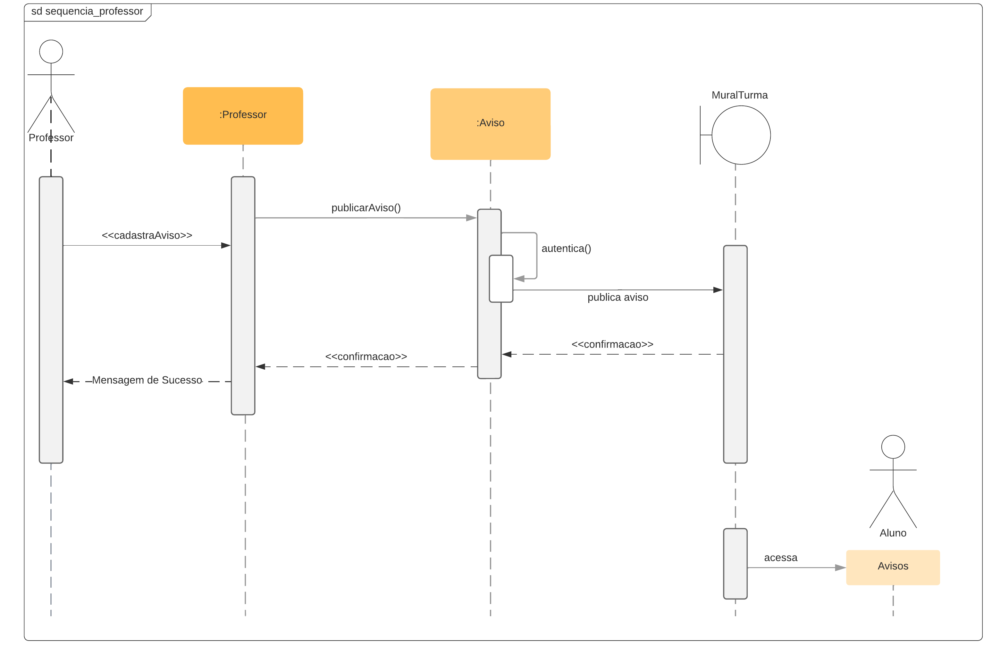
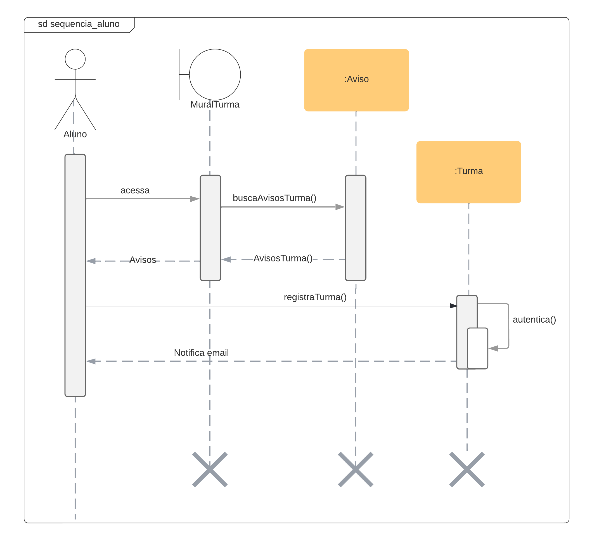

# Diagrama de Sequência

## Introdução

O diagrama de sequência é o diagrama mais importante no UML, principalmente para a fase de projeto de software. Nele podemos ter uma representação detalhada das interações entre os objetos presentes no projeto.
Algumas das principais vantagens do uso do diagrama de sequência são a representação de detalhes de um caso de uso em UML, modelação da lógica de um processo, ver como os objetos integarem com intuito de concluir um processo e ajudar no planejamento e compreensão de uma funcionalidade dentro de um cenário existente do produto.

## Diagrama de Sequência - FGAvisos

Foi utilizada a ferramenta **Lucidchart** para realizar o desenvolvimento do diagrama, foram feitas versões base para teste e validar as ideias.
O diagrama de sequência tem como intuito representar as interações entre os objetos do FGAvisos e distribuílas em linhas de vida bem detalhadas, dando .

### Versão 1

### Versão 2

- Diagrama de Sequência - fluxo do professor
  

- Diagrama de Sequência - fluxo do aluno
  

## Referências

> SERRANO, Milene. Diagrama de Sequência, 2021. Material apresentado na Disciplina de Arquitetura e Desenho de Software do curso de engenharia de software da UnB, FGA.
> O QUE é um diagrama de sequência UML?. [S. l.]. Disponível em: https://www.lucidchart.com/pages/pt/o-que-e-diagrama-de-sequencia-uml. Acesso em: 12 jul. 2022.

## Versionamento

| Data  | Versão |                     Descrição                      |                   Autor(es)                   | Revisor |
| :---: | :----: | :------------------------------------------------: | :-------------------------------------------: | :-----: |
| 10/07 |  0.1   | Estudos para elaboração do diagrama de comunicação | Deivid Carvalho, João Coelho e Mateus Moreira |    Vitor Diniz, Davi Marinho     |
| 13/07 |  0.2   |               Abertura do documento                | Deivid Carvalho, João Coelho e Mateus Moreira |    Vitor Diniz, Davi Marinho     |
| 13/07 |  0.3   |        Elaboração do diagrama professor v1         | Deivid Carvalho, João Coelho e Mateus Moreira |    Vitor Diniz, Davi Marinho     |
| 13/07 |  0.4   |        Elaboração do diagrama professor v2         | Deivid Carvalho, João Coelho e Mateus Moreira |    Vitor Diniz, Davi Marinho     |
| 13/07 |  0.5   |         Adicionando diagramas de professor         | Deivid Carvalho, João Coelho e Mateus Moreira |    Vitor Diniz, Davi Marinho     |
| 13/07 |  0.6   |              Adicionando referências               | Deivid Carvalho, João Coelho e Mateus Moreira |    Vitor Diniz, Davi Marinho     |
| 13/07 |  0.7   |              Adicionando introduções               | Deivid Carvalho, João Coelho e Mateus Moreira |    Vitor Diniz, Davi Marinho     |
| 13/07 |  0.8   |          Elaboração do diagrama de aluno           | Deivid Carvalho, João Coelho e Mateus Moreira |    Vitor Diniz, Davi Marinho     |
| 13/07 |  0.9   |           Adicionando diagrama de aluno            | Deivid Carvalho, João Coelho e Mateus Moreira |    Vitor Diniz, Davi Marinho     |
| 13/07 |  0.10  |             Correção do versionamento              | Deivid Carvalho, João Coelho e Mateus Moreira |    Vitor Diniz, Davi Marinho     |
