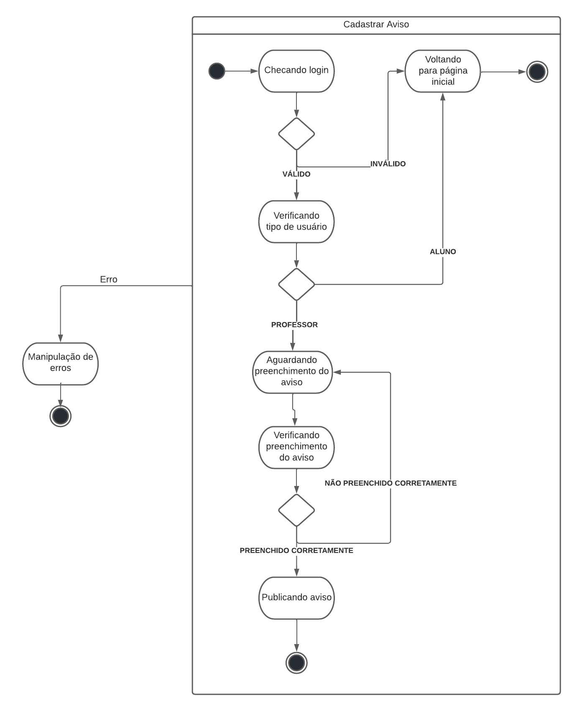

# Diagrama de Estados

## Introdução

O diagrama de estados, ou diagrama de máquina de estados é comportamental na Linguagem de modelagem unificada(UML), nele são apresentadas transições entre os objetos. São apresentadas combinações possíveis entre as informações presentes no objeto.
Os círculos escuros apresentam o estado inicial, enquanto os círculos escuros seguidos de borda representam o estado final.

## Diagrama de Estados - Cadastro de avisos

Foi utilizada a ferramenta **Lucidchart** para realizar o desenvolvimento do diagrama.
O diagrama de estados foi feito para ilustrar os estados em que o sistema se encontra enquanto são cadastrados avisos. 
### O diagrama

## Referências

> SERRANO, Milene. Diagrama de Estados, 2021. Material apresentado na Disciplina de Arquitetura e Desenho de Software do curso de engenharia de software da UnB, FGA.
> O QUE é um diagrama de máquina de estados?. [S. l.]. Disponível em: https://www.lucidchart.com/pages/pt/o-que-e-diagrama-de-maquina-de-estados-uml. Acesso em: 14 jul. 2022.

## Versionamento

| Data  | Versão |                     Descrição                      |                   Autor(es)                   | Revisor |
| :---: | :----: | :------------------------------------------------: | :-------------------------------------------: | :-----: |
| 10/07 |  0.1   | Elaboração do diagrama e do documento | Hugo Rocha | Davi Marinho |
