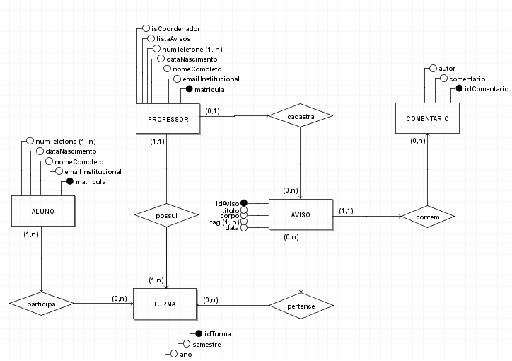
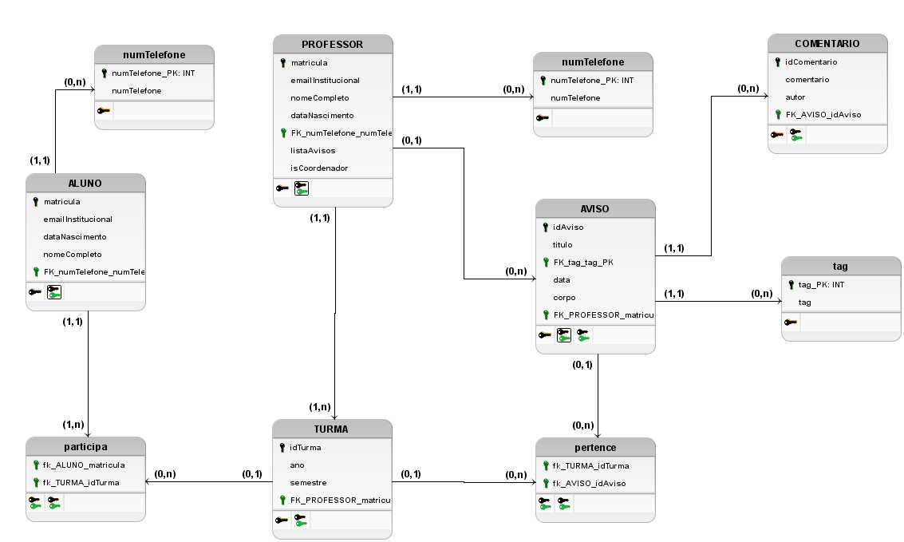

# Diagrama Relacional

## Introdução

O Diagrama Relacional é um diagrama voltado para o banco de dados, e ele é fundamental para a criação do mesmo e também para um projeto de engenharia de software, nesse documento será apresentado alguns diagramas, o ME-R, O DE-R e o DLD.

ME-R, ou Modelo Entidade-Relacionamento, representa o banco de dados em um nível
conceitual. Nele trazemos as representações de nossas entidades, os atributos de cada
uma delas e, por fim, cada relacionamento existente entre as entidades.

DE-R, ou Diagrama Entidade-Relacionamento, baseia-se no ME-R e traz uma representação,
no formato de diagrama, sobre as entidades, os atributos e os relacionamentos. Esse diagrama
fornece uma visão um pouco mais próxima do nível lógico.

DLD, ou Diagrama Lógico de Dados, serve para especificar a um nível mais lógico as entidades,
cada atributo com seus tipos (literal, inteiro, por exemplo), bem como os relacionamentos
e as chaves de cada entidade - primárias ou estrangeiras.

## Modelo Entidade-Relacionamento (ME-R)

Utilizando o [Diagrama de Classes](https://unbarqdsw2022-1.github.io/2022.1_G1_fgAvisos/#/Modelagem/2.1.1.1.DiagramDeClasses) como referência, temos:

### Entidades: 

- **ALUNO**  
- **PROFESSOR**  
- **AVISO**  
- **TURMA**  
- **COMENTARIO**  

### Atributos: 

- **ALUNO** (matricula, emailInstitucional, nomeCompleto, dataNascimento, {numTelefone})  
- **PROFESSOR** (matricula, emailInstitucional, nomeCompleto, dataNascimento, {numTelefone}, listaAvisos, isCoordenador, turmas)  
- **AVISO** (idAviso, titulo, corpo, autor, {tag}, data, {turma}, listaComentario)  
- **TURMA** (idTurma, professor, semestre, ano, alunosCadastrados)  
- **COMENTARIO**  (idComentario, comentario, autor)  

### Relacionamentos: 
 
- PROFESSOR - possui - TURMA -> Um professor pode possuir várias turmas e uma turma pertence a um professor. Cardinalidade: 1:n  
 - AVISO - pertence - TURMA -> Um aviso pode pertencer a várias turmas e uma turma pode conter um ou vários avisos. Cardinalidade: n:m  
 - ALUNO - participa - TURMA -> Um aluno participa de várias turmas e uma turma pode conter vários alunos. Cardinalidade: n:m  
 - PROFESSOR - cadastra - AVISO -> Um professor pode cadastrar vários avisos e um aviso é cadastrado por um professor. Cardinalidade: 1:n  
 - AVISO - contem - COMENTARIO -> Um aviso pode conter vários comentários e um comentário está contido em um aviso. Cardinalidade: 1:n  

## Diagrama Entidade-Relacionamento (DE-R)
Para conseguir visualizar melhor o que foi feito no ME-R nos realizamos o DE-R e nele fica visível as entidades, os atributos e os relacionamentos.

## Diagrama Lógico de Dados (DLD)

Neste diagrama é mostrados mais detalhes à respeito das entidades, das chaves primárias e estrangeiras, dos atributos, relacionamentos etc.

## Referencias

> RISSOLI, Vandor Roberto Vilardi. Sistemas de Bancos de Dados. Disciplina ministrada
na Universidade de Brasília para o curso de Engenharia de Software.

## Versionamento

| Data  | Versão |                     Descrição                      |  Autor(es)  | Revisor |
| :---: | :----: | :------------------------------------------------: | :---------: | :-----: |
| 15/07 |  0.1   | Inicia o documento | Davi Marinho |  xxxx  |
| 15/07 |  0.2   | Adiciona a introdução | Davi Marinho |  xxxx  |
| 15/07 |  0.3   | Adiciona o ME-R e uma referência | Davi Marinho |  Deivid Carvalho  | 
| 15/07 |  0.4   | Adiciona o DE-R | Davi Marinho |  xxxx  | 
| 15/07 |  0.5   | Adiciona o DLD | Davi Marinho |  xxxx  | 
