# Validação do Protótipo de alta fidelidade

## 1. Introdução

No [protótipo de alta fidelidade](https://unbarqdsw2022-1.github.io/2022.1_G1_fgAvisos/#/./Base/modulo_1.1/1.1.10_prototipo_de_alta_fidelidade) foram criados seus fluxos tanto da versão *mobile* quanto *web* e a equipe também criou uma pesquisa para validar o protótipo de alta. Disponível: [pesquisa do protótipo de alta](https://docs.google.com/forms/d/e/1FAIpQLScW0IdaqP_p_kjmbV-zmme7N_QNE6UXlFvu22RHJvotwFg83g/viewform).

O intuito da criação desse questionário é validar as características do [protótipo](https://unbarqdsw2022-1.github.io/2022.1_G1_fgAvisos/#/./Base/modulo_1.1/1.1.10_prototipo_de_alta_fidelidade) e ver se ele realmente cumpre o seu propósito que é atender a comunidade da Faculdade do Gama - FGA, por isso o questionário foi enviado para os estudantes da FGA. Uma das motivações para esse questionário é que percebemos que é melhor fazer reparos na interface da aplicação enquanto ainda está na fase de prototipação, se fôssemos fazer estes mesmos reparos depois de implementar o *Front-End*, tomaria muito mais tempo e esforço da equipe.

### 2. Cabeçalho do questionário

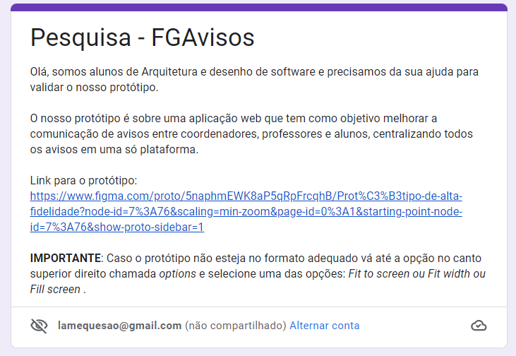

## 3. Questionário

### 3.1. Questão 1

### 3.2. Questão 2

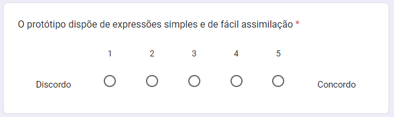

### 3.3. Questão 3

### 3.4. Questão 4

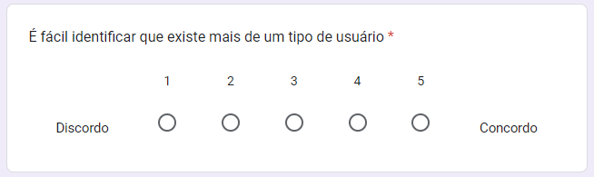

### 3.5. Questão 5

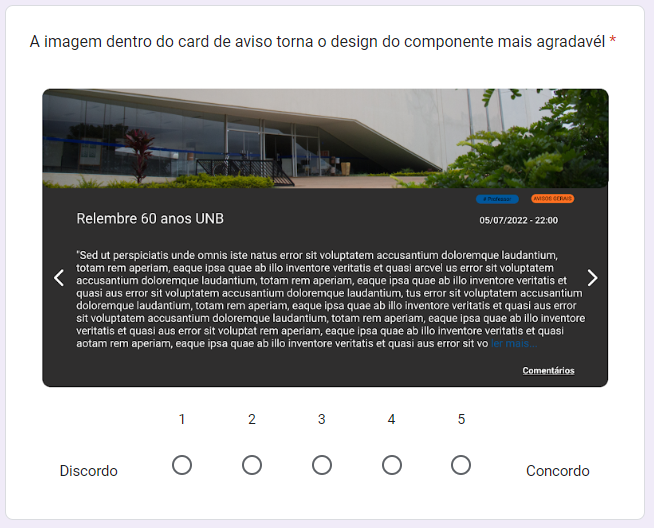

### 3.6. Questão 6

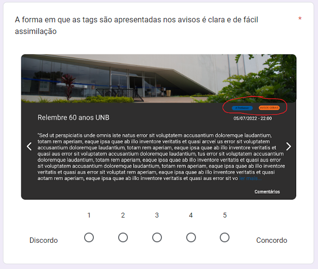

### 3.7. Questão 7

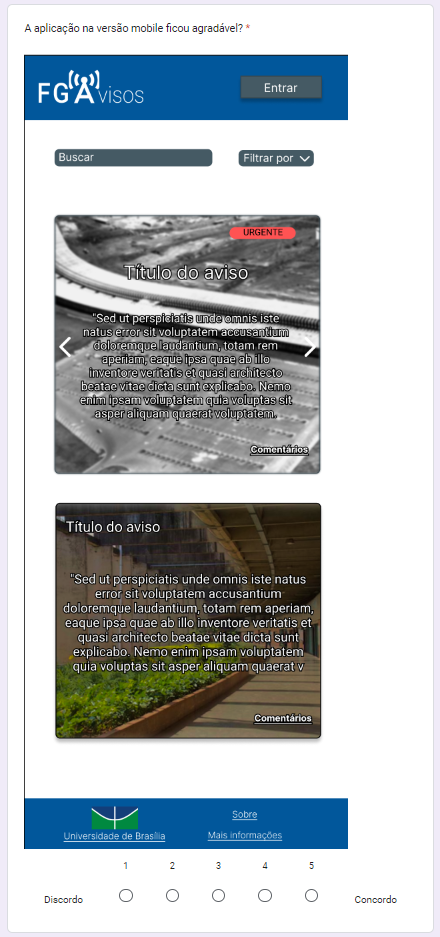

### 3.8. Questão 8

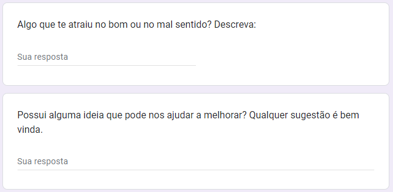

## 4. Resultados obtidos

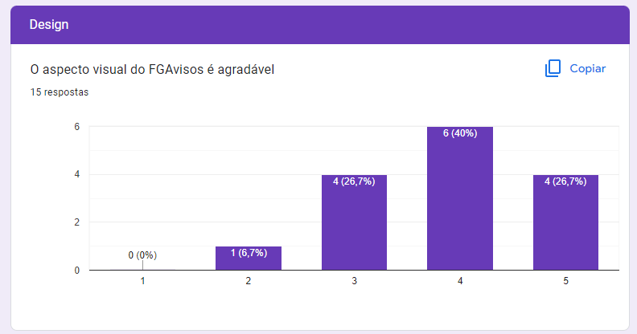

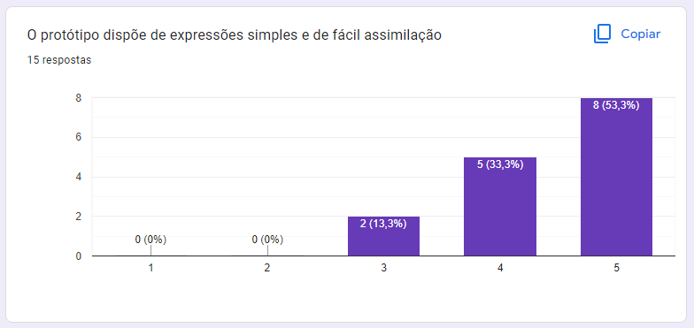

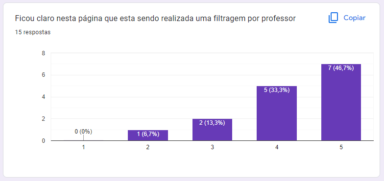

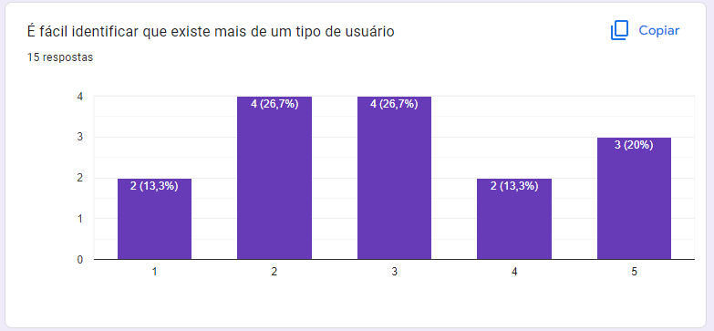

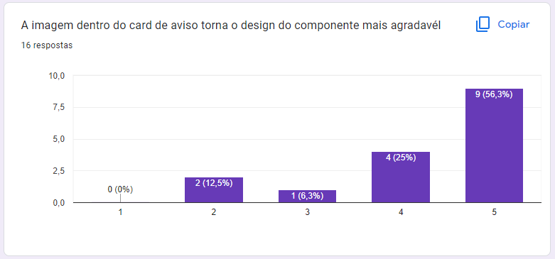

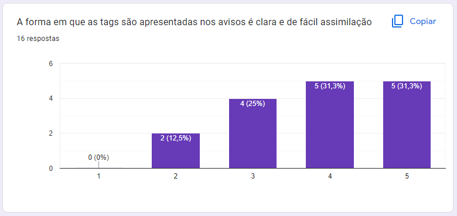

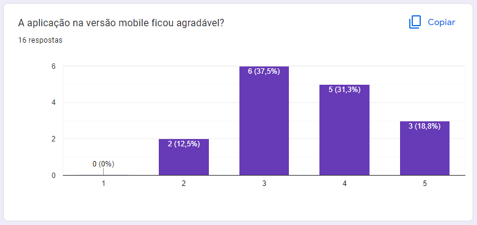

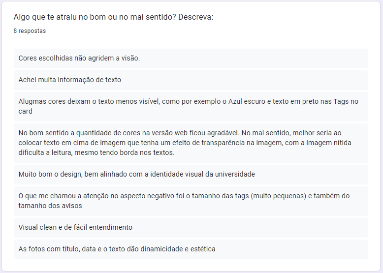

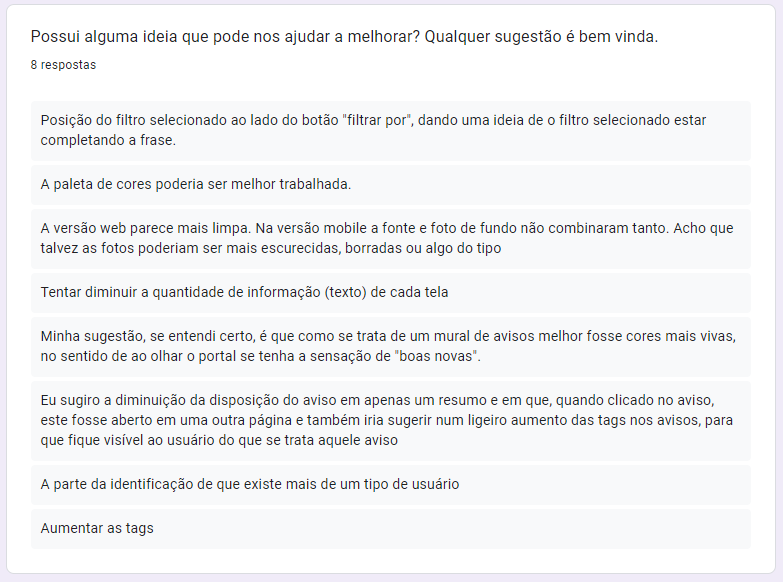

## 5. Conclusões sobre os resultados
- Deve estar mais explícito os papéis na aplicação (coordenador, professor, aluno, administrador)
- As *tags* devem ser maiores, para melhor leitura
- A interface da versão *mobile* deve melhorar para ficar mais parecida com a versão *web*, e consequentemente mais agradável ao usuário
- O texto dentro das *tags* deve ser branco para haver um contraste e melhorar a leitura
- O contorno da fonte na versão *mobile* deve ser mudado para ser mais agradável e combinar com o resto da interface
- Imagens da versão *mobile* devem ser mais transparentes ou devem ter contraste com o texto para facilitar a leitura
- A *tag* de filtragem deve estar do lado do *dropdown* de "filtrar por" para dar a ideia de completar a frase
- Mudar as cores da interface, pois é uma aplicação de notícias
  

## 6. Versionamento

| Data |Versão| Descrição | Autor(es) | Revisor |
|:----:|:----:|:---------:|:-----:|:-----:|
| 15/07 |  0.1  | Adição do básico da validação de protótipo | Antonio Rangel e Lameque Fernandes | Antonio Igor |
