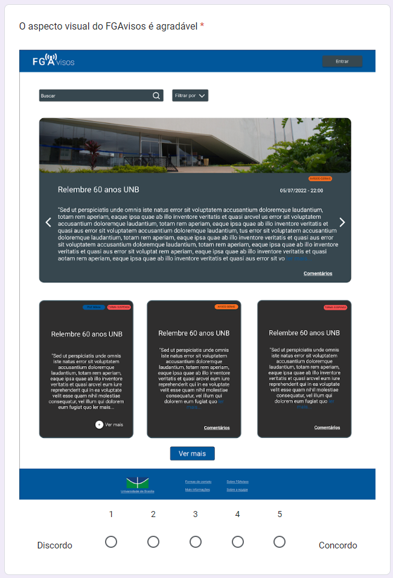
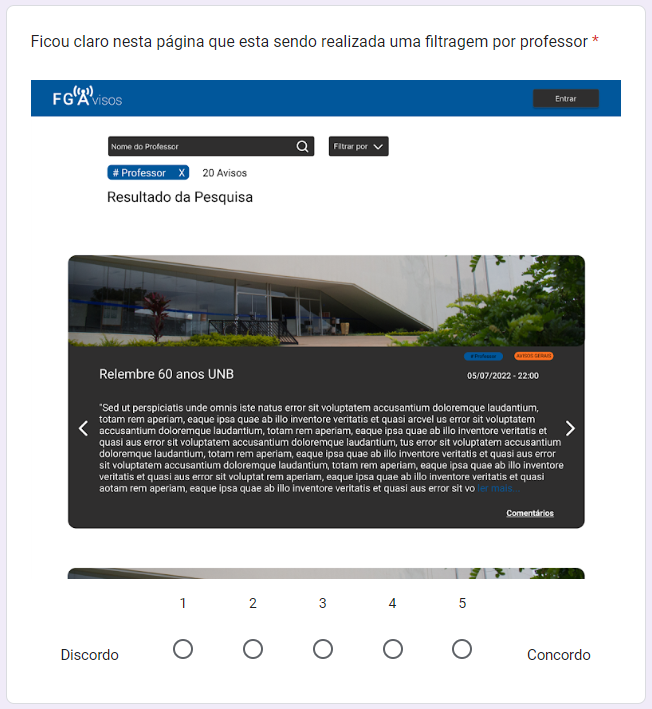

# Validação do Protótipo de alta fidelidade

## 1. Introdução

No [protótipo de alta fidelidade](https://unbarqdsw2022-1.github.io/2022.1_G1_fgAvisos/#/./Base/modulo_1.1/1.1.10_prototipo_de_alta_fidelidade) foram criado seus fluxos tanto da versão *mobile* quanto *web* e a equipe também criou uma pesquisa para validar o protótipo de alta. Disponível: [pesquisa do protótipo de alta](https://docs.google.com/forms/d/e/1FAIpQLScW0IdaqP_p_kjmbV-zmme7N_QNE6UXlFvu22RHJvotwFg83g/viewform).

O intuito da criação desse questionário é validar as características do protótipo e ver se ele realmente cumpre o seu propósito que é atender a comunidade da Faculdade do Gama - FGA, por isso o questionário foi enviado para os estudantes da FGA. Uma das motivações para esse questionário é que percebemos que é melhor fazer reparos na interface da aplicação enquanto ainda está na fase de prototipação, se fôssemos fazer estes mesmos reparos depois de implementar o *Front-End*, tomaria muito mais tempo e esforço da equipe.

### 2. Cabeçalho do questionário

## 3. Questionário

### 3.1. Questão 1

### 3.2. Questão 2

### 3.3. Questão 3

### 3.4. Questão 4

### 3.5. Questão 5

### 3.6. Questão 6

### 3.7. Questão 7

### 3.8. Questão 8

## 4. Resultados obtidos

## 5. Versionamento

| Data |Versão| Descrição | Autor(es) | Revisor |
|:----:|:----:|:---------:|:-----:|:-----:|
| 15/07 |  0.1  | Adição do básico da validação de protótipo | Antonio Rangel e Lameque Fernandes | xxxx |