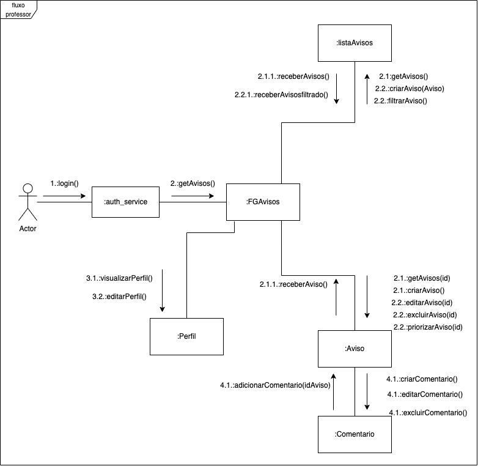
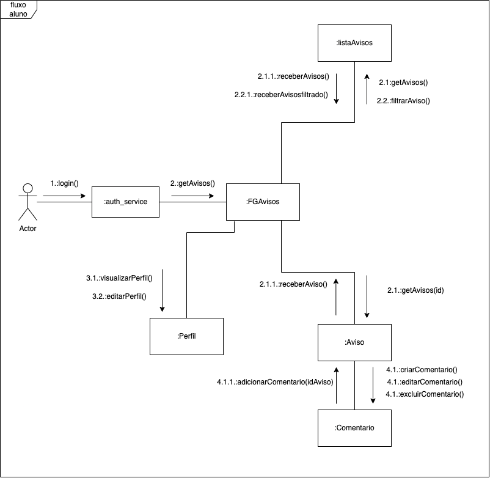
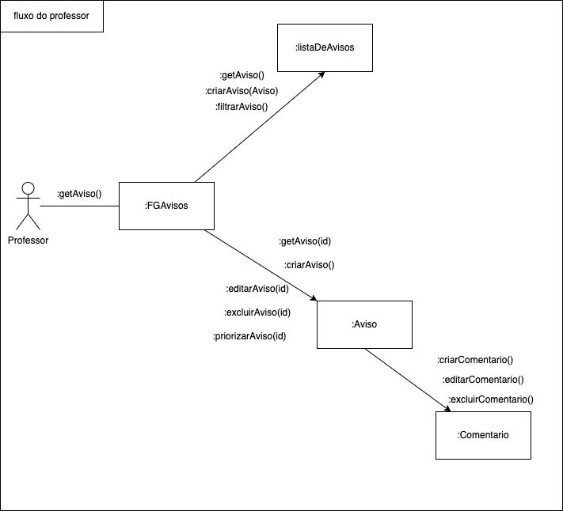
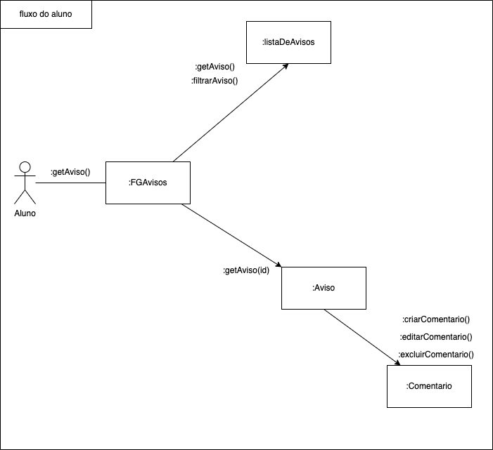

# Diagrama de Comunicação

## Introdução

Conforme apresentado na disciplina de Arquitetura e Desenho de Software do curso de Engenharia de Software da Universidade de Brasília, FGA, o diagrama de comunicação, também conhecido como diagrama de colaboração, é um diagram dinâmico que mostra a interação entre os objetos usando setas e mensagens diretas. Em modelos UML, uma interação é um comportamento que representa a comunicação entre um ou mais participantes. O objetivo deste diagrama é ilustrar o fluxo de mensagens entre os objetos da interação, capturando o comportamento de determinado cenário, mostrando a mensagem trocada entre os objetos com enfâse na ordem estrutural das mensagens.

Segundo as especificações do _OMG™ Unified Modeling Language™ (OMG UML®)_ corresponde a um diagrama de sequência simples sem mecanismos de estruturação, como usos de interação e fragmentos combinados. É composto pelos principais elementos: quadro, linha de vida e mensagem.

## Diagrama de comunicação - FGAvisos

Utilizamos a ferramenta Drawio para desenvolver o diagrama e também usamos o UML Communications Diagrams Overview como guia. Foi feito um rascunho e validado com toda a equipe através de mensagens e chamada de voz.

### Versão 2

- Diagrama de comunicação - fluxo do professor

- Diagrama de comunicação - fluxo do aluno

### Versão 1

- Diagrama de comunicação - fluxo do professor

- Diagrama de comunicação - fluxo do aluno

## Referências

> SERRANO, Milene. Diagrama de Colaboração, 2021. Material apresentado na Disciplina de Arquitetura e Desenho de Software do curso de engenharia de software da UnB, FGA.

> Criando Diagramas de Comunicação, IBM. https://www.ibm.com/docs/pt-br/rsar/9.5?topic=diagrams-creating-communication

## Versionamento

| Data  | Versão |                     Descrição                      |  Autor(es)  | Revisor |
| :---: | :----: | :------------------------------------------------: | :---------: | :-----: |
| 05/07 |  0.1   | Estudos para elaboração do diagrama de comunicação | Vitor Diniz |  xxxx   |
| 06/07 |  0.2   |               Abertura do documento                | Vitor Diniz |  xxxx   |
| 07/07 |  0.3   |  Elaboração da introdução e ferramenta utilizada   | Vitor Diniz |  xxxx   |
| 08/07 |  0.4   |               Elaboração do diagrama               | Vitor Diniz |  xxxx   |
| 09/07 |  0.5   |     Adicionando diagrama do fluxo do professor     | Vitor Diniz |  xxxx   |
| 09/07 |  0.6   |               Arrumando Referências                | Vitor Diniz |  xxxx   |
| 09/07 |  0.7   |       Adicionando diagrama do fluxo do aluno       | Vitor Diniz |  xxxx   |
| 12/07 |  0.7   |              Adicionando diagramas v2              | Vitor Diniz |  xxxx   |
| 12/07 |  0.7   |               Finalizando documento                | Vitor Diniz |  xxxx   |
