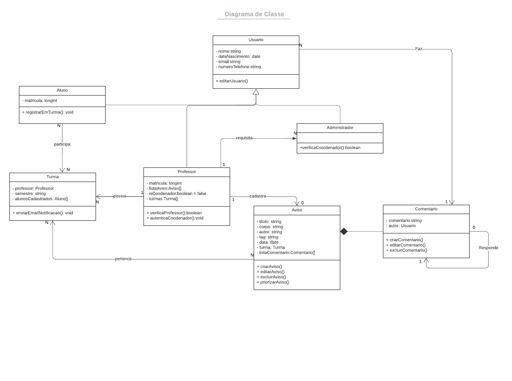

# Especialista

## Introdução

O padrão especialista é dos princípios mais básicos dentro dos 9 GRASP's existentes. Em linhas gerais, o padrão especialista é uma abordagem genérica que visa atribuir a responsabilidade de fazer ou conhecer algo ao "especialista na informação" - a classe possui a informação necessária para cumprir tal responsabilidade.

O Especialista traz à tona a ótica do questionamento de quais são as camadas que devem conhecer umas às outras e qual a direção desse conhecimento. Isto é, uma classe X pode instanciar uma classe Y sem que esta tenha contato de fato com a camada implementada em X.

## Aplicação

Uma classe Venda possui a informação de uma venda composta por um ou mais itens. Cada item é representado pela classe ItemVendido, que pode ser composta por um objeto da classe Produto (que, por sua vez, possui a informação do seu preço unitário) e a quantidade vendida.

Para calcular o total da venda dos itens, a classe Venda poderia primeiro calcular os subtotais dos itens obtendo os preços unitários da classe Produto por meio da classe ItemVendido e as respectivas quantidades, e por fim somar os subtotais.

Entretanto, segundo o padrão Especialista, a modelagem adequada é passar para a classe ItemVendido a responsabilidade de calcular seus próprios subtotais, uma vez que ela possui (ou pode obter) as informações necessárias. A classe Venda é, por sua vez, a responsável por obter os subtotais dos objetos da classe ItemVendido e somá-los, calculando assim o total da venda.

Portanto, o especialista em informar os preços unitários é a classe Produto, o especialista em calcular os subtotais é a classe ItemVendido e o especialista em calcular o total da venda é a classe Venda.

## Aplicação no projeto

Uma possível aplicação do Especialista, está sendo representada na figura 1, onde temos o Diagrama de Classes.

No Diagrama, temos a classe Usuário e Professor. Segundo o padrão Especilista, quando temos um caso onde será postado um aviso, a classe que irá realizar essa função será a classe Professor, invés da classe Usuário. Pois a classe Professor é o "especialista na informação" nesse cenário.

<h4 align = "center">Figura 1: Diagrama de Classes</h6>
<h4 align = "center">Fonte: Autores</h6>

## Referências

> SERRANO, Milene. GRASP Especialista, 2020. Material apresentado na Disciplina de Arquitetura e Desenho de Software do curso de engenharia de software da UnB, FGA.

> Expert (padrão de projeto) Wikipedia. Disponível em: https://pt.wikipedia.org/wiki/Expert_(padr%C3%A3o_de_projeto_de_software) Acesso em: 08 ago 2022

> Desenvolvimento com qualidade com GRASP. Disponível em: https://www.devmedia.com.br/desenvolvimento-com-qualidade-com-grasp/28704. Acesso em: 08 ago 2022

## Versionamento

| Data  | Versão |            Descrição             |  Autor(es)  | Revisor |
| :---: | :----: | :------------------------------: | :---------: | :-----: |
| 08/08 |  0.1   |        Criando documento         | Vitor Diniz |  Victor Hugo, João Coelho   |
| 08/08 |  0.2   | Adicionando introdução e exemplo | Vitor Diniz |  Victor Hugo, João Coelho   |
| 08/08 |  0.3   |  Inserção aplicação no projeto   | Vitor Diniz |  Victor Hugo, João Coelho   |
| 08/08 |  0.4   |    Adicionando figura e fonte    | Vitor Diniz |  Victor Hugo, João Coelho   |
| 08/08 |  0.5   |     Adicionando referências      | Vitor Diniz |  Victor Hugo, João Coelho   |
