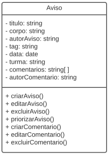
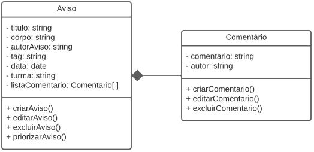
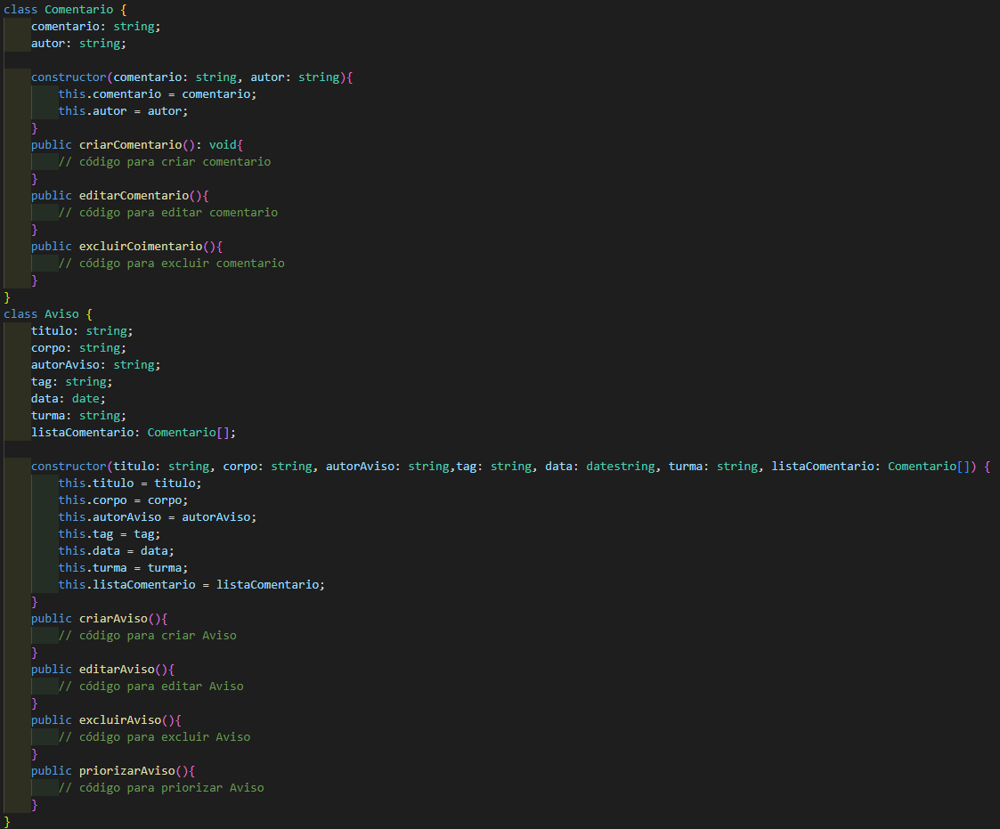

# Alta Coesão

## Introdução

Alta coesão, no paradigma orientado a objeto, nos temos que seguir e entender que cada classe deve ter apenas propósitos e responsabilidades claros.

A coesão está ligada ao princípio da responsabilidade única e que diz que uma classe deve ter apenas uma responsabilidade e não podendo assumir responsabilidades que não são suas.

## Metodologia

A elaboração do documento ocorreu tanto de forma individual como em dupla, os encontros foram realizados na plataforma Discord durante o dia 08/08/2022.

## Resultados

O nosso projeto busca alcançar uma alta coesão, para que todas as classes possuam apenas responsabilidades referentes a própria classe, deixando-a mais compacta, possibilitando melhor reuso, manutenção e compreensão do código. Um exemplo se dá na classe de Avisos, onde pode ser dividida em duas classes distintas: avisos e comentários. Com essa divisão as responsabilidades de ambas as classes passam a ser mais individualizadas.

<h4 align = "center">Figura 1: Exemplo contrário</h6>
<h4 align = "center">Fonte: Autores</h6>

<h4 align = "center">Figura 2: Exemplo correto</h6>
<h4 align = "center">Fonte: Autores</h6>

Agora no exemplo a seguir, criamos um código em TypeScript para exemplificar como seria a codificação deste GRASP, como podemos ver todas as classes estão separadas e suas funções também estão assim respeitando o princípio de alta coesão.

<h4 align = "center">Figura 3: Codigo Exemplo</h6>
<h4 align = "center">Fonte: Autores</h6>

## Referências

Entendendo Coesão e Acoplamento. Disponível em https://www.devmedia.com.br/entendendo-coesao-e-acoplamento/18538. Acesso em 07 de agosto de 2022.

Alta Coesão - Padrões Grasp. Disponível em https://www.ramonsilva.net/post/alta-coes%C3%A3o-padr%C3%B5es-grasp. Acesso em 07 de agosto de 2022.

## Versionamento

| Data  | Versão |                     Descrição                      |  Autor(es)  | Revisor |
| :---: | :----: | :------------------------------------------------: | :---------: | :-----: |
| 07/08 |  0.1   |          Adiciona a introdução          | Davi Marinho              |  Antonio Igor, João Coelho  |
| 08/08 |  0.2   |          Adicionando resultados         | Antonio Igor, Davi Marinho|  João Coelho  |
