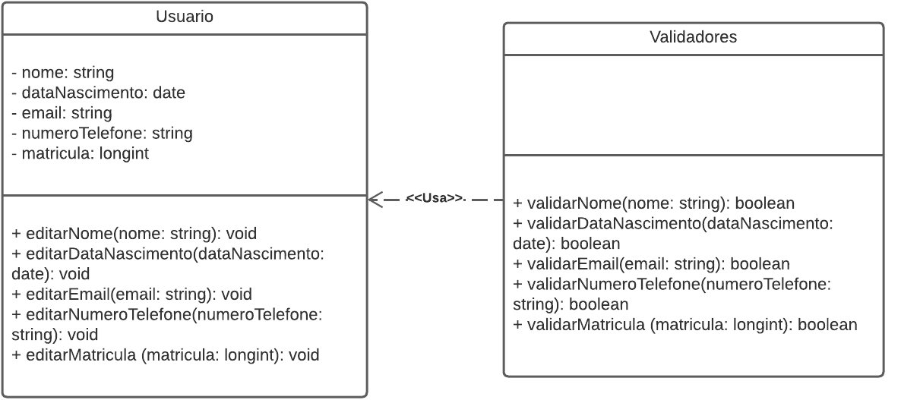

# Baixo Acoplamento

## Introdução

Baixo acoplamento é a conexão entre elementos do sistema feita de uma forma que eles dependam pouco uns dos outros. Essa abordagem possui o objetivo de reduzir os riscos de uma mudança em um elemento gerar efeitos indesejados em outros elementos. Com o baixo acoplamento é mais fácil isolar problemas e realizar manutenções necessárias de maneira eficiente.

## Aplicação no projeto

Uma possível aplicação do baixo acoplamento é no método de cadastrar usuário, que possui várias subrotinas ao longo de sua execução. Na Figura 1 é mostrada como seria a diagramação com o métododo cadastrarUsuario() altamente acoplado, e na figura 2 a diagramação com baixo acoplamento. 

## Resultados

Resultados do documento.

Se for utilizado imagens, usar esse padrão:

<h4 align = "center">Figura 1: Alto Acoplamento</h6>
<h4 align = "center">Fonte: Autores</h6>

<h4 align = "center">Figura 2: Baixo Acoplamento</h6>
<h4 align = "center">Fonte: Autores</h6>

## Referências

>loose coupling. Disponível em <https://www.techtarget.com/searchnetworking/definition/loose-coupling>. Acesso em 02/08/2022.

## Versionamento

| Data  | Versão |                     Descrição                      |  Autor(es)  | Revisor |
| :---: | :----: | :------------------------------------------------: | :---------: | :-----: |
| 02/08 |  0.1   |      Criação do documento                          |    Antonio Rangel     |  XXXX   |
| 02/08 |  0.2   |      Adição da introdução e aplicação no projeto   |    Antonio Rangel     |  XXXX   |
| 05/08 |  0.3   |      Adição dos resultados  |    Antonio Igor e Antonio Rangel     |  XXXX   |