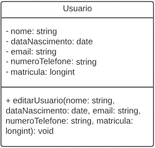
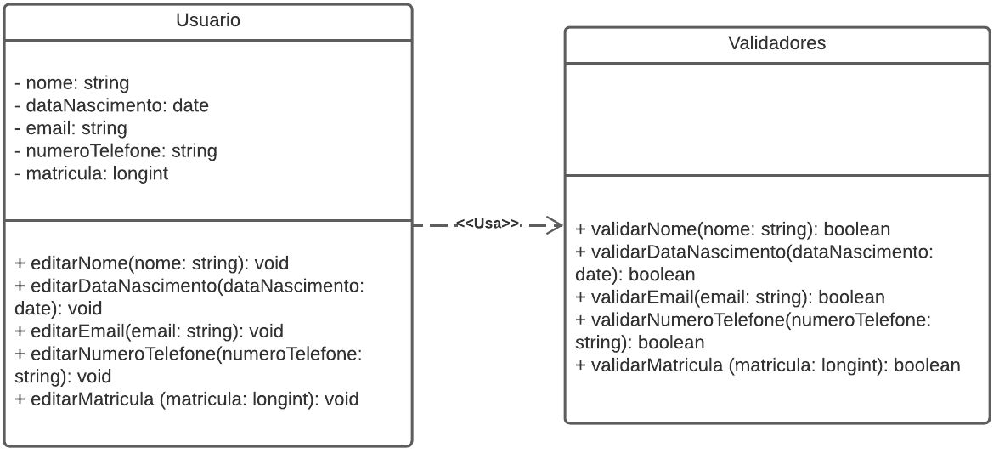

# Baixo Acoplamento

## Introdução

Baixo acoplamento é a conexão entre elementos do sistema feita de uma forma que eles dependam pouco uns dos outros. Essa abordagem possui o objetivo de reduzir os riscos de uma mudança em um elemento gerar efeitos indesejados em outros elementos. Com o baixo acoplamento é mais fácil isolar problemas e realizar manutenções necessárias de maneira eficiente.

## Aplicação no projeto

Uma possível aplicação do baixo acoplamento é no método de editar usuário, que possui várias subrotinas ao longo de sua execução, algumas delas sendo de validação dos dados. Na Figura 1 é mostrada como seria a diagramação com o método editarUsuario() que é altamente acoplado, com todas as validações ocorrendo dentro do mesmo método e recebendo obrigatoriamente todos os parâmetros. Já na figura 2, a diagramação é feita com baixo acoplamento, pois as subrotinas de validação foram desacopladas do método editarUsuario() e levadas para uma classe que abarca todos esses métodos de validação. O próprio método editarUsuario() foi separado em métodos menores, que só editam um parâmetro específico **quando** são chamados.  

## Resultados

<h4 align = "center">Figura 1: Alto Acoplamento</h6>
<h4 align = "center">Fonte: Autores</h6>

<h4 align = "center">Figura 2: Baixo Acoplamento</h6>
<h4 align = "center">Fonte: Autores</h6>

## Referências

> loose coupling. Disponível em <https://www.techtarget.com/searchnetworking/definition/loose-coupling>. Acesso em 02/08/2022.

## Versionamento

| Data  | Versão |                     Descrição                      |  Autor(es)  | Revisor |
| :---: | :----: | :------------------------------------------------: | :---------: | :-----: |
| 02/08 |  0.1   |      Criação do documento                          |    Antonio Rangel     |  Deivid Carvalho e Lameque Fernandes   |
| 02/08 |  0.2   |      Adição da introdução e aplicação no projeto   |    Antonio Rangel     |  Deivid Carvalho e Lameque Fernandes   |
| 05/08 |  1.0   |      Adição dos resultados  |    Antonio Igor e Antonio Rangel     |  Deivid Carvalho e Lameque Fernandes   |
| 08/08 |  1.0   |      Revisão de gramática  |    Antonio Igor e Antonio Rangel     |  Hugo Rocha   |
| 11/08 | 1.1 | Adicionando nova imagem de baixo acoplamento com correção | Antonio Rangel | Davi Marinho, Lameque Fernandes |
