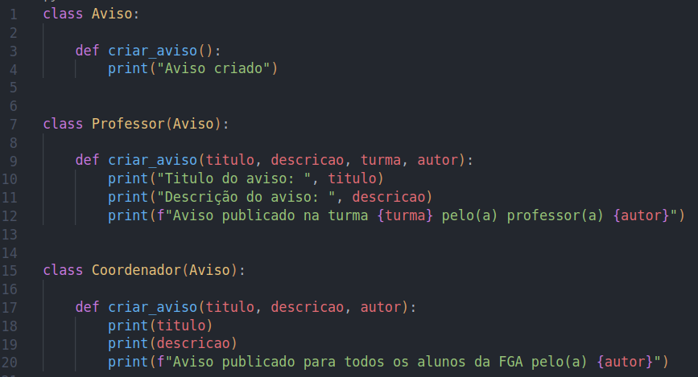

# Polimorfismo

## Introdução

Polimorfismo é um dos pilares da programação orientada a objetos. Através do polimorfismo classes derivadas de uma classe base possuem a capacidade de se comportar de uma maneira diferente mesmo utilizando a mesma assinatura.

Utilizando o Polimorfismo, é possivel ter um classe Default com atributos e métodos padrões e criar uma classe derivada da classe Default com implementações lógicas diferentes utilizando a mesma assinatura.

## Aplicação no projeto

Uma possível aplicação do Polimorfismo está sendo representada na Figura 1, onde utilizamos uma classe default chamada Aviso, e através dela é possível realizar implementações lógicas nos métodos para diferentes tipos de usuário.

## Resultados

<h4 align = "center">Figura 1: Exemplo básico de Polimorfímo</h6>
<h4 align = "center">Fonte: Autores</h6>

## Referências

> SERRANO, Milene. GRASP Polimorfismo, 2020. Material apresentado na Disciplina de Arquitetura e Desenho de Software do curso de engenharia de software da UnB, FGA.

## Versionamento

| Data  | Versão |                     Descrição                      |  Autor(es)                             | Revisor |
| :---: | :----: | :------------------------------------------------: | :------------------------------------: | :-----: |
| 06/08 |  0.1   |        Introdução do documento                     |    Lameque Fernandes                   |  XXXX   |
| 06/08 |  0.2   | Inserção de exemplo e resultados do documento      |    Lameque Fernandes e João Coelho     |  XXXX   |
| 06/08 |  0.3   | Inserção de Referências                            |    João Coelho                         |  XXXX   |
| 06/08 |  0.4   | Correções Ortográficas                             |    João Coelho                         |  XXXX   |
