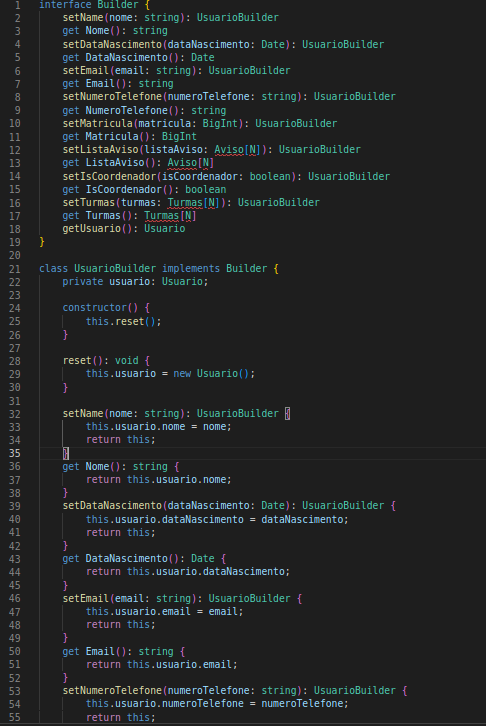
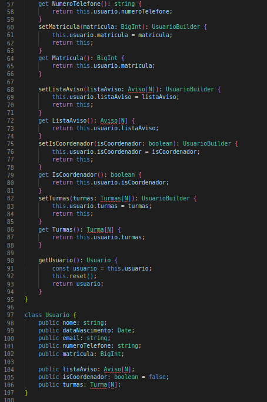
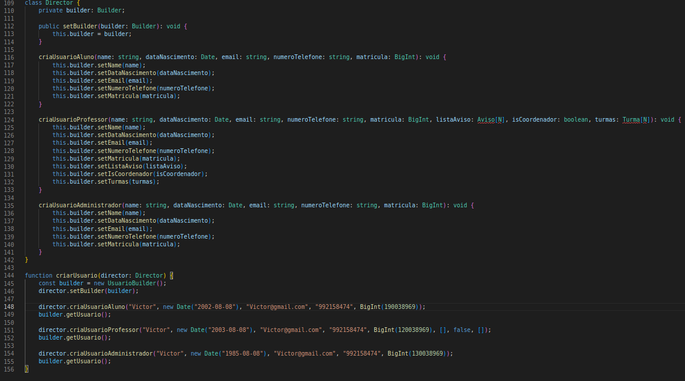

# Builder

## Introdução

O Builder é um padrão de projeto criacional que procura construir objetos complexos de uma forma mais "enxuta". O padrão Builder é muito utilizado pela comunidade, um dos principais motivos é a possibilidade de fugir de construtores monstruosos, pois, através dele pode-se construir objetos "passo a passo", utilizando apenas as etapas que realmente são necessárias, assim, não é necessário passar diversos parâmetros nos construtores.

Por exemplo, na maioria dos casos o construtor possui vários parâmetros e nem todos os parâmetros são necessários em todos os casos. E o Builder trás uma solução, para isto. 

É muito interessante utilizar o Builder quando deseja-se utilizar o mesmo objeto de diferentes ângulos, por exemplo: mesa de vidro e madeira ou casa de pedra e madeira.

## Metodologia

Foi realizado um pareamento com alguns integrantes da equipe para a discussão e entendimento do padrão apresentado, assim foi construido um exemplo de implementação desse padrão no nosso projeto.

## Resultados

Resultados do documento.

Se for utilizado imagens, usar esse padrão:

<h4 align = "center">Figura 1: Exemplo 1 Builder</h6>
<h4 align = "center">Fonte: Autores</h6>

<h4 align = "center">Figura 2: Exemplo 2 Builder</h6>
<h4 align = "center">Fonte: Autores</h6>

<h4 align = "center">Figura 3: Exemplo 3 Director</h6>
<h4 align = "center">Fonte: Autores</h6>

## Referências

> REFACTORING. Builder. Disponível em: https://refactoring.guru/pt-br/design-patterns/builder. Acesso em: 07 ago. 2022.

> REFACTORING. Builder em Python. Disponível em: https://refactoring.guru/pt-br/design-patterns/builder/python/example. Acesso em: 07 ago. 2022.

> REFACTORING. Builder em Typescript. Disponível em: https://refactoring.guru/pt-br/design-patterns/builder/typescript/example. Acesso em: 08 ago. 2022.

> IMASTERS. Design Patterns com JavaScript & TypeScript: Padrões Criacionais. Disponível em: https://imasters.com.br/javascript/design-patterns-com-javascript-typescript-padroes-criacionais. Acesso em: 08 ago. 2022.

> SOURCE CODE EXAMPLES. TypeScript Builder Pattern Example. Disponível em: https://www.sourcecodeexamples.net/2020/08/typescript-builder-pattern-example.html. Acesso em: 08 ago. 2022.

> Sean Bradley. Builder Design Pattern in TypeScript. Disponível em: https://medium.com/design-patterns-in-typescript/builder-design-pattern-in-typescript-4f4f454a8ca2. Acesso em: 08 ago. 2022.

## Versionamento

| Data  | Versão |                     Descrição                      |  Autor(es)               | Revisor |
| :---: | :----: | :------------------------------------------------: | :----------------------: | :-----: |
| 07/08 |  0.1   | Adição da introdução                               | Lameque Fernandes        |  XXXX   |
| 07/08 |  0.2   | Adição de conteúdo na introdução e nas referências | Lameque Fernandes        |  XXXX   |
| 08/08 |  0.3   | Adição da metodologia                              | Mateus Moreira e Victor Hugo |  XXXX   |
| 09/08 |  0.4   | Adição das figuras e referências                   | Mateus Moreira e Victor Hugo |  XXXX   |