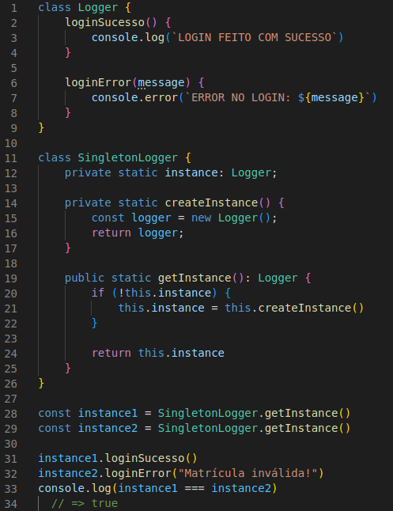

# Singleton

## Introdução

O Singleton é um padrão de projeto criacional que permite a você garantir que uma classe tenha apenas uma instância, enquanto provê um ponto de acesso global para essa instância. Singletons são úteis em situações em que as ações do sistema devem ser coordenadas à partir de um local central, um bom exemplo é o pool de conexões do banco de dados. O pool gerencia a criação, a distribuição e o tempo de vida de todas as conexões de banco de dados para todo o aplicativo, garantindo que nenhuma conexão esteja perdida.

Fazendo uma analogia com o mundo real, o governo pode ser usado como exemplo de um padrão Singleton. Um país pode ter apenas um governo oficial. Independentemente das identidades pessoais dos indivíduos que formam governos, o título, “O Governo de X”, é um ponto de acesso global que identifica o grupo de pessoas no commando.

## Aplicação no projeto

Uma possível aplicação do Singleton é em logs, que entram em todas as transações que o cliente fizer, seja cadastrando um usuário, fazendo login no sistema, etc. Então, podemos criar uma classe Logger, que terá a responsabilidade de escrever os logs da forma que ela quiser, e em todas as classes que gerenciam uma ou mais trasações só será necessário utilizar o Singleton da classe Logger e não criar uma instância para cada. Portanto, na Figura 1 temos um exemplo desse Singleton.

## Resultados

<h4 align = "center">Figura 1: Exemplo do Singleton</h6>
<h4 align = "center">Fonte: Autores</h6>

## Referências

> REFACTORING. Singleton. Disponível em: <https://refactoring.guru/pt-br/design-patterns/singleton>. Acesso em: 10 de ago. de 2022

> MEDIUM. Singleton Design Pattern. Disponível em: <https://medium.com/rafaelantoniolucio/singleton-design-pattern-3e903f625265>. Acesso em: 10 de ago. de 2022

## Versionamento

| Data  | Versão |                     Descrição                      |  Autor(es)  | Revisor |
| :---: | :----: | :------------------------------------------------: | :---------: | :-----: |
| 10/08 |  0.1   |                     Adição da introdução                   |    Victor Hugo     |  XXXX   |
| 10/08 |  0.2   |                     Adição da aplicação no projeto e o exemplo                   |    Victor Hugo     |  XXXX   |