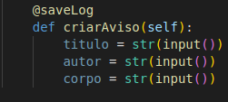
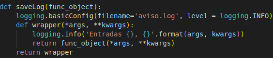

# Decorator

## Introdução

A ideia é esclarecer a utilidade do GOF decorator, apresentando de maneira geral, sua sintaxe. E demonstrar como será implementado, no período de construção do nosso software.

## Metodologia

Em uma reunião no dia 08/08, após criarmos documentos gerais e que julgamos necessários, foi inicuadi o trabalho aqui neste GOF decorator. Em razão do contexto do nosso projeto ser pequeno, não foi possível pensar em uma forma de utilizar esse GOF para complementar os tipos de avisos que temos.
Então, a ideia que o autor teve, foi adicionar uma espécie de log para termos onde verificar o que foi feito e o tempo de execução para tal tarefa, e esta funcionalidade puder ser re-utilizada em qualquer objeto/método.

No python, para criarmos um decorator, podemos seguir uma sintaxe feita pela própria linguagem:

<h4 align = "center">Figura 1: Chamada decorador</h6>
<h4 align = "center">Fonte: Autor</h6>

<h4 align = "center">Figura 2: Método Decorator</h6>
<h4 align = "center">Fonte: Autor</h6>

O GOF Decorator possui a ideia de complementar alguma funcionalidade, criando uma extensão e adicionando novas características ao método ou classe.

## Resultados

Podemos observar que a função que possui um decorator, é executado em tempo de execução.
~~~python
import time, logging

def saveLog(func_object):
    logging.basicConfig(filename='aviso.log', level = logging.INFO)
    def wrapper(*args, **kwargs):
        logging.info('Entradas {}, {}'.format(args, kwargs))
        return func_object(*args, **kwargs)
    return wrapper

def tempoExecucao(func_object):
    def wrapper(*args, **kwargs):
        init = time.time()
        func_exec = func_object(*args, **kwargs)
        fim = time.time() - init
        print(f'{fim:.2f}')
        return func_exec  
    return wrapper

class Professor():
    def __init__(self):
        self.matricula = None
        self.listaAviso = []
        self.isCoordenador = False
        self.turma = "Instância de Turma"
    def setAviso(self, aviso):
        return self.listaAviso.append(aviso)

class Aviso():
    def __init__(self):
        self.titulo = None
        self.corpo = None
        self.autor = None
        self.tag = None
        self.turma = None
        self.listaComentario = None
    
    @tempoExecucao
    @saveLog
    def criarAviso(self):
        titulo = str(input())
        autor = str(input())
        corpo = str(input())

        
def main():
    professor = Professor()
    aviso = Aviso()

    professor.setAviso(aviso.criarAviso())
    

if __name__ == "__main__":
    main()

~~~

## Referências

Primer on Python Decorators. Disponível em <https://realpython.com/primer-on-python-decorators/>. Acesso em 05/08/22.

## Versionamento

| Data  | Versão |                     Descrição                      |  Autor(es)  | Revisor |
| :---: | :----: | :------------------------------------------------: | :---------: | :-----: |
| 10/08 |  0.1   |                     Definição do GOF                   |    Deivid Carvalho     |  XXXX   |
| 10/08 |  0.2   |                     Terminando documento                   |    Deivid Carvalho     |  XXXX   |