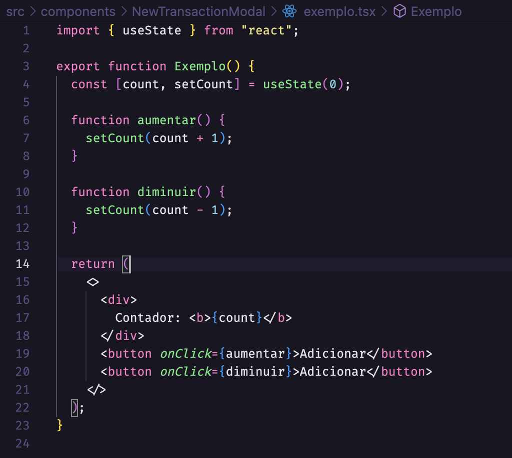

# Gof Comportamental - State

## Introdução

O padrão Gof State tem como objetivo simplificar a complexidade de um objeto. Para isso, pegamos um objeto complexo e dividimos em vários objetos menos complexos. Porém esse padrão possui utilidade em classes que mudam de comportamento dependendo do estado de outro objeto e utilizando o padrão, a troca de estado do objeto e/ou da classe fica muito menos complexa. Outro fato interessante, é que utilizando o padrão, a classe aparenta ser modificada em tempo de execução, melhorando a responsividade da aplicação.

## Aplicação

No projeto FGAvisos, será utilizado o framework React para a construção do Front-end. O React possui o hook useState, que é um hook específico que altera o estado interno de uma variável sem precisar implementar lógicas complexas.

## Exemplo

Um dos exemplos na aplicação é a utilização do useState para manter váriaveis que serão inputadas e atualizadas pelos usuários.

<h4 align = "center">Figura 1: GoF State Exemplo Counter</h6>
<h4 align = "center">Fonte: Autores</h6>

## Referências

> Mão na massa: State. Disponível em: https://brizeno.wordpress.com/category/padroes-de-projeto/state/ . Último acesso em: 10/08/2022.

> Javascript State. Disponível em: https://www.dofactory.com/javascript/design-patterns/state# . Último acesso em: 10/08/2022.

> Usando o State do Hook. Disponível em: https://pt-br.reactjs.org/docs/hooks-state.html . Último acesso em: 10/08/2022.

## Versionamento

| Data  | Versão |                              Descrição                               |  Autor(es)  | Revisor |
| :---: | :----: | :------------------------------------------------------------------: | :---------: | :-----: |
| 10/08 |  0.1   |                       Adicionando a introdução                       | Hugo Rocha  |  XXXX   |
| 10/08 |  0.2   |              Inserção de parágrafo de uso na aplicação               | Vitor Diniz |  XXXX   |
| 10/08 |  0.3   |                          Adicionando imagem                          | Vitor Diniz |  XXXX   |
| 10/08 |  0.4   |                       Adicionando referências                        | Vitor Diniz |  XXXX   |
| 10/08 |  0.5   | Adicionando parágrafo de exemplo e corrigindo parágrafo de aplicação | Vitor Diniz |  XXXX   |
