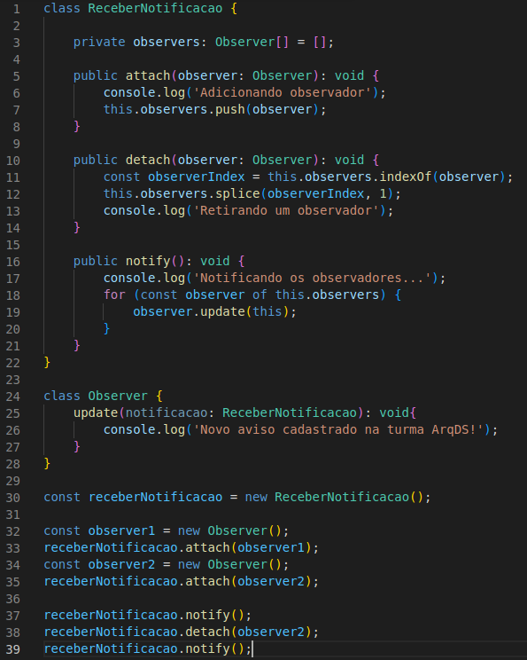

# Observer

## Introdução

O observer é um padrão Gof comportamental que pode fazer com que possa ser definido um mecanismo de assinatura para notificar para múltiplos objetos sobre os eventos que acontecem no objeto que estão sendo observados por eles.

Utilizando o padrão, podem ser criados objetos publicadores (aqueles que enviam uma notificação) e os objetos assinantes ("aqueles que assinam" o objeto publicador).

## Metodologia

O documento foi feito durante uma reunião para conclusão dos documentos realizada no dia 10/08 pelo discord, foi iniciado por um membro e terminado por outro. Mas sempre tirando dúvida com a equipe que estava presente.

## Aplicação no projeto

Uma possível aplicação do Observer no projeto é para notificações para os alunos de novos avisos que foram cadastrados para uma turma. Um aluno que se registrou em uma turma(publicador) escolhe a opção de receber notificações de novos avisos se torna um "assinante".

## Resultados

<h4 align = "center">Figura 1: Exemplo do Observer</h6>
<h4 align = "center">Fonte: Autores</h6>

## Referências

> REFACTORING. Observer. Disponível em: <https://refactoring.guru/pt-br/design-patterns/observer>. Acesso em: 10 de ago. de 2022

> REFACTORING. Observer em TypeScript. Disponível em: <https://refactoring.guru/pt-br/design-patterns/observer/typescript/example>. Acesso em: 10 de ago. de 2022

## Versionamento

| Data  | Versão |            Descrição             |  Autor(es)  |   Revisor   |
| :---: | :----: | :------------------------------: | :---------: | :---------: |
| 10/08 |  0.1   |      Adicionando introdução      | Hugo Rocha  | Vitor Diniz |
| 10/08 |  0.2   | Adicionando aplicação no projeto | Victor Hugo | Vitor Diniz, Antonio Rangel |
