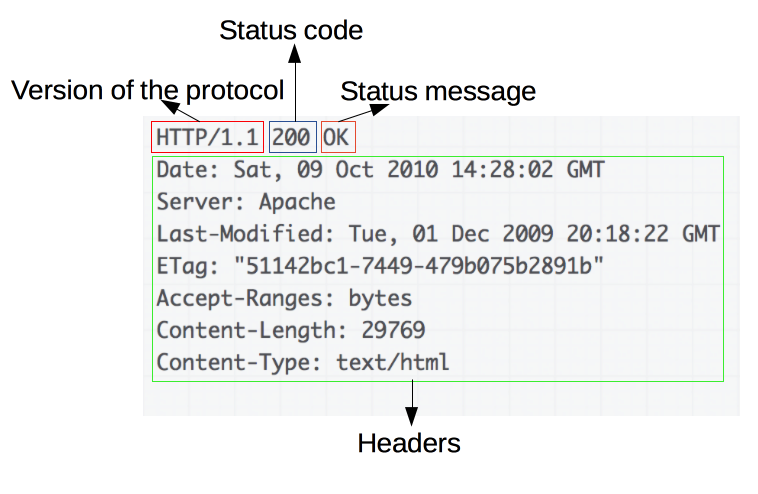
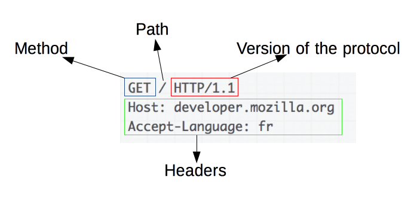
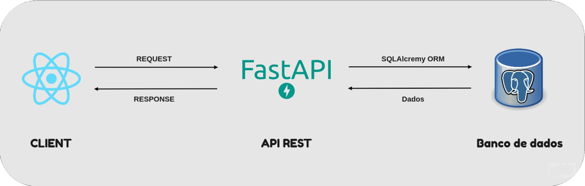
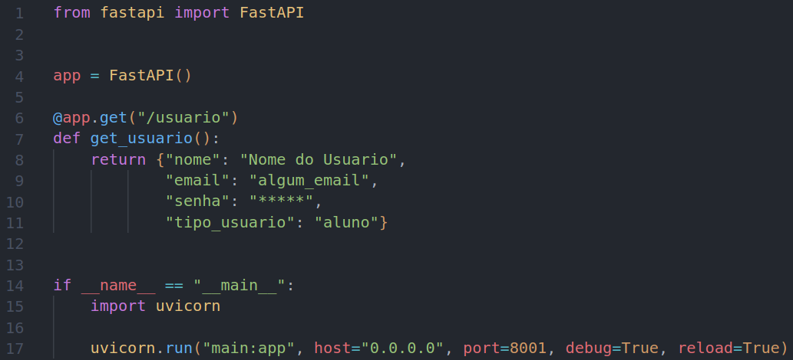
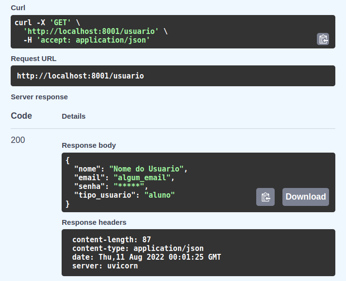

# API REST

## Introdução

Para iniciar esse conteúdo é necessário que seja entendido alguns termos, eles serão explicados aqui na introdução, mas nos resultados daremos mais ênfase e mais informações sobre eles.

- API: Uma API (Application Programming Interface) é um conjunto de definições e protocolos utilizados no desenvolvimento e na integração de aplicações.

- HTTP: O HTTP (Hypertext Transfer Protocol) é um protocolo de comunicação entre um navegador e um servidor web.

- REST: O REST (Representational State Transfer) é um estilo arquitetural que define uma série de restrições para a criação de APIs.

O REST não é um padrão exclusivo para HTTP como muitos pensam, embora suas bases sejam as mesmas.

O padrão REST é descrito em seis restrições, sendo elas:

- Uniform Interface
- Stateless
- Cacheable
- Client-server
- Layered System
- Code on Demand (Opcional).

Já para o termo "RESTful", não existe uma definição formal, mas podemos entende-lo como sendo o termo utilizado para definir API's HTTP que adotam o padrão REST.

## Metodologia

Para a elaboração da [apresentação](https://www.canva.com/design/DAFINc4Wurs/lc_gjowzEkKgXO0Yl_Qk9Q/edit?utm_content=DAFINc4Wurs&utm_campaign=designshare&utm_medium=link2&utm_source=sharebutton) todo o grupo se reuniu através da plataforma Discord durante o dia 04/08/2022. Para a criação do documento a mesma metodologia foi utilizada, com a única diferença que a reunião foi realizada com um menor número de membros.

### Comunicação HTTP

Uma API e o servidor web se comunicam por meio de "mensagens" HTTP e existem dois tipos de mensagens, Responses e Requests cada uma tem seu próprio formato.

A Response tem o formato:

<h4 align = "center"> Figura 1: Formato da Response </h6>
<h4 align = "center"> Fonte: Bruno Brito </h6>

Podemos ver a seguinte estrutura:

- Method: É o método do HTTP. Abaixo há uma tabela com os métodos mais utilizados.
- Path: É o endereço do resource que deseja obter.
- Version of the protocol: Versão do protocolo HTTP. Atualmente o mais comum é o HTTP/1.1. Mas já há a versão 2 do HTTP. Inclusive o GRPC já suporta.
- Headers: Os headers entregam informações adicionais para o server.
- Body: É o conteúdo, geralmente é utilizado em conjunto com os verbos POST, PUT e PATCH.

Métodos mais utilizados:

| HTTP Method | Descrição                                  |
| ----------- | ------------------------------------------ |
| OPTIONS     | Busca métodos HTTP válidos e outras opções |
| GET         | Busca um resource                          |
| HEAD        | Busca apenas o header de um resource       |
| PUT         | Atualiza um resource                       |
| POST        | Cria um resource                           |
| DELETE      | Remove um resource                         |
| PATCH       | Atualiza parcialmente um resource          |

O Request tem o formato:

<h4 align = "center"> Figura 2: Formato do Request </h6>
<h4 align = "center"> Fonte: Bruno Brito </h6>

Podemos ver a seguinte estrutura:

- Versão do protocolo HTTP
- Status Code: O código de status é separado por categorias.
  - 2xx: Status de sucesso
  - 3xx: Categoria de redirecionamento
  - 4xx: Erro no Client
  - 5xx: Erro no Server
- Status Message: A frente do Status Code virá uma breve descrição do que significa o Status Code.
- Headers: Haverá informações para o Client, por exemplo o formato da resposta, se o conteúdo pode ser cacheado.
- Body: O body é opcional, dependendo do request, haverá body ou não no conteúdo da resposta.

### Por que utilizar API REST

Como o REST é um estilo arquitetural que define uma série de restrições para a criação de APIs, ao utilizá-lo temos um padrão de comunicação definido, o que facilita a comunicação entre sistemas.

### Restrições

Stateless - O servidor não mantém estado. Cada solicitação enviada pelo cliente para o servidor deve conter todas as informações necessárias para que essa solicitação seja entendida. O estado da sessão é mantido inteiramente pelo cliente.

Cacheable - A resposta de uma solicitação deve informar se o dado pode ser mantido em cache, que deve ser mantido e gerenciado pelo cliente.

Client-Server - O objetivo dessa restrição é separar as responsabilidades do frontend e backend, essa separação pode promover ganhos principalmente na criação de testes e na escalabilidade das aplicações.

Uniform interface - Esse princípio é definido por quatro restrições:

- Identificar os recursos (URI).
- Manipular recursos através de verbos HTTP.
- Mensagens auto-descritivas, cada requisição deve conter informações suficientes para o server processar a informação.
- Hypermedia As The Engine Of Application State. Esta restrição diz que a response deve conter links de conteúdos relacionados ao resource.

Layered system - O sistema deve ter uma arquitetura em camadas. As separações de responsabilidades são importantes neste modelo de arquitetura. Por isso é sugerido usar a construção de camadas independentes e auto gerenciadas, onde todas elas desconhecem as outras camadas. Então caso ocorra alguma mudança em um delas as demais não terão impactadas.

Code on demand (opcional) - o REST permite que a funcionalidades do client seja estendida baixando e executando applets ou scripts.

## Exemplo do projeto

Uma exemplificação do padrão REST no contexto do projeto pode ser visto na imagem abaixo, onde a framework Web FastAPI será utilizado para a criação de uma API REST utilizando Python.

<h4 align = "center"> Figura 3: Representação da comunicação do projeto FGAvisos </h6>
<h4 align = "center"> Fonte: Lameque Fernandes </h6>

## Resultados

<h4 align = "center"> Figura 4: Possivel implementação de GET utilizando FastAPI </h6>
<h4 align = "center"> Fonte: Autores </h6>

<h4 align = "center"> Figura 5: Possivel Response da API apresentada na figura 4 </h6>
<h4 align = "center"> Fonte: Autores </h6>

## Referências

> API REST. Disponível em: https://www.redhat.com/pt-br/topics/api/what-is-a-rest-api. Acesso em: 10 ago. 2022.

> What is a RESTful API?. Disponível em: https://tutorialedge.net/software-eng/what-is-a-rest-api/. Acesso em: 10 ago. 2022.

> Design patterns for modern web APIs. Disponível em: https://blog.feathersjs.com/design-patterns-for-modern-web-apis-1f046635215. Acesso em: 10 ago. 2022.

> GraphQL vs REST. Disponível em: https://hasura.io/learn/graphql/intro-graphql/graphql-vs-rest/. Acesso em: 10 ago. 2022.

> Padrão Rest. Disponível em: https://www.brunobrito.net.br/padrao-rest/. Acesso em: 10 ago. 2022.

> O que é REST? – Um resumo rápido. Disponível em: https://josiaspereira.com.br/o-que-e-rest-um-resumo-rapido/. Acesso em: 10 ago. 2022.

## Versionamento

| Data  | Versão |                         Descrição                          |         Autor(es)          |   Revisor   |
| :---: | :----: | :--------------------------------------------------------: | :------------------------: | :---------: |
| 10/08 |  0.1   |                    Criação do documento                    | Antonio Igor, Davi Marinho | Vitor Diniz, Victor Hugo, João Coelho |
| 10/08 |  0.2   | Adição de exemplos de código para implementar uma API REST |     Lameque Fernandes      | Vitor Diniz, Victor Hugo, Antonio Rangel, João Coelho |
